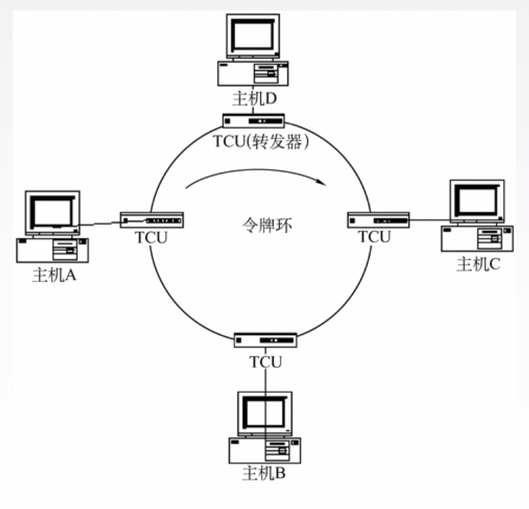
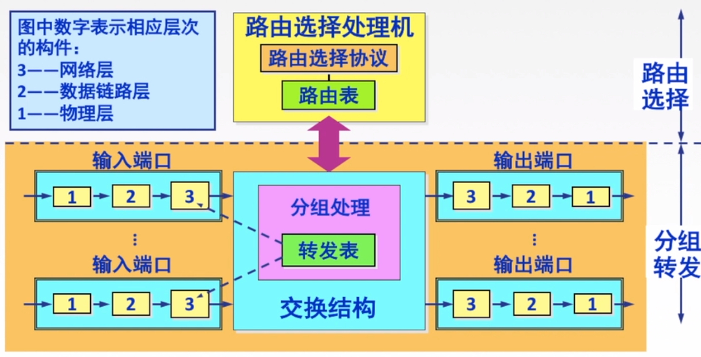

# 应该是最全的计算机网络知识点

[toc]

---
---
## 第一章 概述

### 计算机网络
- **计算机网络**：是将一个分散的、具有独立功能的**计算机系统**，通过**通信设备**与**线路**连接起来，由功能完善的**软件**实现**资源共享**和**信息传递**的系统。
  > 计算机网络是**互连**的、**自治**的计算机集合。

---
### 计算机网络的组成

#### 组成部分
- 硬件：主机（端系统）、链路（双绞线、光纤等）、通信设备（路由器、交换机等）。
- 软件：安装在主机上的应用程序。
- **协议**：一系列规则、约定的集合。

#### 工作方式
- **边缘部分**：由所有连接在互联网上的**主机**组成。这部分是**用户直接使用的**，用来进行通信（传送数据、音频或视频）和资源共享。通信方式有**C/S（客户-服务器）方式**和**P2P（对等）方式**两种（具体可见[网络应用模型](#网络应用模型)）。
  1. C/S方式
    客户和服务器都是指通信中所涉及的两个应用进程。**客户是服务请求方，服务器是服务提供方。**
  2. P2P方式
    两台主机都运行了对等连接软件（P2P软件），它们就可以进行平等的对等连接通信。
- [**核心部分**](#按交换技术进行分类)：由大量的网络和连接这些网络的路由器组成。这部分是**为边缘部分提供服务的**。

#### 功能组成
- 通信子网：实现**数据通信**
  > 通信子网包括OSI模型中的**物理层、数据链路层、网络层**
  > 由各种传输介质、通信设备、相应的网络协议组成
- 资源子网：实现**资源共享**、数据处理
  > 资源子网包括OSI模型中的**会话层、表示层、应用层**
  > 由实现资源共享功能的设备和软件组成

---
### 计算机网络的分类

#### 按作用范围进行分类
1. **广域网WAN** (Wide Area Network)，使用**交换技术**。
2. **城域网MAN** (Metropolitan Area Network)
3. **局域网LAN** (Local Area Network)，使用**广播技术**。
4. **个人局域网PAN** (Personal Area Network)

#### 按使用者进行分类
- 公用网（公众网），所有愿意按电信公司的规定缴纳费用的人都可以使用这种网络。
- 专用网，不向本单位以外的人提供服务，例如军队、铁路、银行、电力等系统。

#### 按交换技术进行分类
- [电路交换](#电路交换)
- [报文交换](#报文交换)
- [分组交换](#分组交换)

#### 按拓扑结构进行分类
- 总线型
- 星型
- 环型
- 网状型，常用于**广域网**
</img>

#### 按传输技术进行分类
- 广播式网络：共享公共通信信道，常用于**局域网**。
  应用：早期的总线以太网、无线局域网。
  经典拓扑结构：总线型、星型（逻辑总线型）。
- 点对点网络：两个相邻结点通过一个链路相连，使用**分组存储转发**和**路由选择机制**，常用于**广域网**。应用：PPP协议。

---
### 标准化工作及相关组织

#### 标准的分类
- 法定标准：由权威机构制定的正式的、合法的标准。 **OSI**
- 事实标准：某些公司的产品在竞争中占据了主流，时间长了这些产品中的协议和技术就成了标准。 **TCP/IP**

#### RFC(Request For Comments) “请求评论” -- 互联网标准的形式
所有的互联网标准都是以RFC的形式在互联网上发表的，但并非所有的RFC文档都是互联网标准。
指定互联网的正式标准要经过一下三个阶段：
1. 互联网草案 (Internet Draft)，有效期只有六个月，在这个阶段还不能算是RFC文档。
2. 建议标准 (Proposed Standard)，从这个阶段开始成为RFC文档。
3. 互联网标准 (Interner Standard)，达到正式标准后，每个标准就分配到一个编号STD xx。一个标准可以和多个RFC文档关联。

#### 标准化工作的相关组织
- **ISO** (Internet Organization for Standardization)，**国际标准化组织**。
- **ITU** (Internet Telecommunication Union)，**国际电信联盟**。
- **IEEE** (Institute of Electrical and Eletronics Engineers)，**国际电子电气工程师协会**
- **IETF** (Internet Engineering Task Force)，**互联网工程任务组**，负责互联网相关标准的制定。

---
### 计算机网络的性能指标

#### 速率
定义：数据率或数据传输率或**比特率**， 单位是b/s, kb/s, Mb/s, Gb/s, Tb/s。
> 比特率即为连接在计算机网络上的**主机**在数字信道上传送数据**位数的速率**

> 1Byte = 8bit，
> 使用速率时，1kb/s = 1000b/s；使用存储容量时，1kb = ${2}^{10}$b

#### 带宽
定义：原本指某个信号具有的频带宽度，即**最高频率与最低频率之差**，单位是**赫兹**（Hz）。
现指网络的通信线路传送数据的能力，通常是指单位时间内从网络中的某一点到另一点所能通过的**最高数据率**，单位与速率单位相同。
> 带宽指的是**主机向链路发送**的速度，不是在链路中传播的速度。

#### 吞吐量
定义：在单位时间内通过某个网络（或信道、接口）的**实际的**数据量，单位是b/s, kb/s, Mb/s, Gb/s, Tb/s。
> 吞吐量受网络的带宽和网络的额定速率的限制。

#### 时延
指数据（报文、分组、比特流）从网络（或链路）的一段传送到另一端所需的时间。单位是s。
- **发送时延**（传输时延）
定义：从发送数据帧的**第一个比特**算起，到该帧的**最后一个比特发送完毕**所需的时间。
$$发送时延=\frac{数据帧长度(bit)}{发送速率（带宽）(bit/s)}$$
> 对于一定的网络，发送时延与发送的帧长成正比，与发送速率成反比。
- **传播时延**
定义：电磁波在信道中传播一定的距离需要花费的时间。
$$传播时延=\frac{信道长度(m)}{电磁波在信道上的传播速率(m/s)}$$
> **发送时延**发生在机器内部的发送器中，**与传输信道的长度没有任何关系**；
> **传播时延**发生在机器外部的传输信道媒体上，**与信号的发送速率无关**；
> 高速链路提高的仅仅是数据的发送速率，而非比特在链路上的传播速率。
- 排队时延
分组在进入路由器后要先在**输入队列**中排队**等待处理**，在路由器确定转发接口后还要在**输出队列**中排队**等待转发**，这就产生了排队时延。
- 处理时延
收到分组时，主机或路由器要花费一定时间进行处理，如分析分组的首部、从分组中提取数据部分、进行**差错检验**或**查找适当路由**等。

#### 时延带宽积
定义：$$时延带宽积={传播时延(s)}\times{带宽(b/s)}$$

</img>

时延带宽积又叫做以**比特为单位的链路长度**，用来描述某段链路当前的容量（链路中有多少比特）。

#### 往返时间RTT (Round-Trip Time)
定义：从发送方发送数据开始，到发送方收到接收方的确认之间的时延。
$$RTT={传播时延}\times{2}+末端处理时间（常忽略）$$
> RTT越大，在收到确认之前，可以发送的数据就越多。
> **ping**命令的返回的结果就是RTT的值。

##### 有效数据率
定义：$$有效数据率=\frac{数据长度}{{发送时延}+{RTT}}$$

#### 利用率
- 信道利用率
定义：某信道被利用（有数据通过）的时间的占比。
- **网络利用率**
定义：全网络的信道利用率的加权平均值。
用${D_0}$表示网络空闲时的时延，${D}$表示网络当前的时延，可以用下面公式来表示${D_0}$、${D}$和网络利用率${U}$之间的关系：$${D}=\frac{D_0}{1-U}$$

</img>

> 信道或网络的利用率过高会产生**非常大的时延**。

---
### 计算机网络体系结构
计算机网络体系结构：计算机网络的各层及其协议的集合。
体系结构是抽象的，而其实现是指能运行的一些软件和硬件。

#### 分层结构
- 分层的原因
  将庞大而复杂的问题转化为若干较小的局部问题，再进行研究和处理
- 分层的原则
  - 各层之间相互*独立*，每层只实现一种相对独立的功能。
  - 每层之间**界面自然清晰**，易于理解，相互交流尽可能少。
  - 结构上可分隔开。每层都采用**最合适的技术**来实现。
  - 保持下层对上层的独立性，**上层单向使用下层提供的服务**。
  - 整个分层结构应该能够促进标准化工作。
- 分层结构
</img>
  - 实体：任何可发送或接收信息的硬件或软件进程。第n层中的活动元素称为**n层实体**，同一层的实体叫**对等实体**。
  - **协议**：为进行网络中的**对等实体**数据交换而建立的规则、标准或约定成为网络协议。包括语法、语义、同步三要素：
    - **语法**：规定传输数据的格式；
    - **语义**：规定所要完成的功能；
    > **语法**规定数据含几部分
    > **语义**规定每部分都是什么含义
    - **同步**：规定各种操作的顺序。
  - 接口（服务访问点 SAP, Service Access Point）：上层使用下层服务的入口。
  - **服务**：**下层为相邻上层**提供的功能调用。上层使用下层所提供的服务必须通过与下层交换一些命令，这些命令被称为**服务原语**。
  > **协议**是**不同主机、同层实体**之间的数据交换规则，是**水平**方向上的概念。
  > **服务**是**相同主机、相邻层实体**之间的功能调用，是**竖直**方向上的概念。

#### OSI/RM 参考模型

</img>

- **应用层**：所有能够和用户交互产生网络流量的程序。
  典型应用层服务：文件传输 (FTP)、电子邮件 (SMTP)、万维网 (HTTP)。
- 表示层：用于处理两个通信系统中交换信息的表示方式（语法和语义）。
  表示层的功能：数据格式变换、数据加密解密、数据压缩和恢复。
  典型表示层服务：联合图像专家组 (JPEG)、美国信息交换标准代码 (ASCII)。
- 会话层：向表示层实体/用户进程提供**建立连接**并在连接上有序地**传输数据**。也叫**建立同步**。
  会话层的功能：
  - 建立、管理、终止会话；
  - 使用校验点可使会话在通信失效时从**校验点/同步点**继续恢复通信，实现数据同步。
- **传输层**：负责主机中两个进程的通信，即端到端的通信。传输单位是**报文段** (TCP) 或**用户数据报** (UDP)。
  传输层的功能：
  - 可靠/不可靠传输
  - 差错控制
  - 流量控制、拥塞控制
  - 复用、分用
  > 复用：**多个**应用层进程可**同时**使用下面传输层的服务。
  > 分用：传输层把收到的信息分别交付给上面应用层中**相应**的进程。
- **网络层**：主要任务是把分组从源端传到目的端，为分组交换网上的不同主机提供通信服务。传输单位是**数据报**。
  网络层的功能：
  - 路由选择
  - 流量控制
  - 差错控制
  - 拥塞控制
- **数据链路层**：主要任务是把网络层传下来的数据报组装成帧。传输单位是**帧**。
  数据链路层的功能：
  - 成帧：定义帧的开始和结束
  - 差错控制
  - 流量控制
  - 访问（接入控制）：控制对信道的访问
- **物理层**：主要任务是在**物理媒体**上实现比特流的**透明传输**。传输单位是**比特**。
  > 透明传输：不管所传数据是什么样的比特组合，都应当能够在链路上传输。

  物理层的功能：
  - 定义接口特性
  - 定义传输模式：单工、半双工、全双工
  - 定义传输速率
  - 比特同步
  - 比特编码

#### TCP/IP 参考模型

</img>

> OSI和TCP模型的共同点：
> 1. 都分层
> 2. 都基于独立的协议栈概念
> 3. 都可以实现异构网络的互联

> 不同点：
> 1. OSI定义三点：服务、协议、接口
> 2. OSI模型**先于协议出现**，不偏向任何协议
> 3. TCP/IP模型设计之初就考虑到异构网的**互联**问题，将网络层作为重要层次
>
> ||OSI参考模型|TCP/IP参考模型
> :--:|:--:|:--:
> 网络层|无连接+面向连接|无连接
> 传输层|面向连接|无连接+面向连接

#### 5层参考模型

  
  

---
---
## 第二章 物理层

### 数据通信模型

#### 相关术语
- **数据**：传输信息的实体，通常是有意义的符号序列。
- **信号**：数据的电气/电磁表现，是数据在传输过程中的**存在形式**。
  根据信号中代表消息的参数的取值方式不同，信号可分为以下两大类：
  - 模拟信号（连续信号）：代表消息的参数取值是连续的。
  - 数字信号（离散信号）：代表消息的参数取值是离散的。
- 信源：产生和发送数据的源头。
- 信宿：接收数据的终点。
- **信道**：信号的传输媒介。一般用来表示向某一个方向传送信息的媒体。因此一条通信线路往往包含一条发送信道和一条接收信道。
  > 传输模拟信号的叫模拟信道，传输数字信号的叫数字信道。

#### 三种通信方式
- 单工通信：只能有一个方向的通信而没有反方向的交互。仅需要**一条**信道。
- 半双工通信：通信的双方都可以发送或接收信息，但任何一方都不能同时发送和接收，需要**两条**信道。
- 全双工通信：通信的双方可以同时发送和接收信息，需要**两条**信道。

#### 两种传输方式
- 串行传输：速度**慢**，费用**低**，适合**远**距离。
- 并行传输：速度**快**，费用**高**，适合**近**距离。常用于计算机内部数据传输。

#### 码元
**定义**：码元是指用一个**固定时长**的**信号波形**（数字脉冲），代表不同离散数值的基本波形，是数字通信中数字信号的计量单位，这个时长内的信号称为码元，该时长成为**码元宽度**。当码元的离散状态（**取值**）有M个时，此时码元为**M进制**码元。
**一个码元可以携带多个比特的信息量**。$m$进制码元携带了$log_{2}{m}$bit的数据。
> 例如16进制码元0000~1111，即携带了4bit的信息量。

#### 波特率、比特率
- 码元传输速率（**波特率**）：它表示单位时间内数据通信系统所传输的**码元个数**（也可称为脉冲个数或信号变化的次数），单位是**波特**（Baud），1Baud表示数字系统每秒传输1个码元。
- 信息传输速率（**比特率**）：表示单位时间内数字通信系统传输的**二进制**码元个数（**比特数**），单位是b/s。
  > 波特率与码元的进制数**无关**。
  > 若传输的是$n$进制的码元，则$m$ Baud的波特率所对应的比特率为 ${m}\times{log_{2}{n}}$ bit/s。

---
### 编码 & 调制

#### 信道上传送的信号
- **基带信号**：**来自信源**的、直接表达了要传输信息的信号。
  将数字信号的0和1直接用两种不同的电压表示，再送到**数字信道**上进行传输。这种方式叫**基带传输**。
- **宽带（通带）信号**：经过载波调制后的基带信号（**仅在一段频率范围内能够通过信道**）。
  把基带信号进行载波调制，再转换为模拟信号，然后送到**模拟信道**上进行传输。这种方式叫**宽带传输**。
  > 传输距离较**近**时，计算机网络采用基带传输方式（近距离衰减小，信号内容不容易发生变化）
  > 传输距离较**远**时，计算机网络采用宽带传输方式（远距离衰减大，即使信号变化大也能过滤出来基带信号）

#### 编码
定义：将数字信号转换为另一种数字信号的过程叫做**编码**。（模拟信号转化为数字信号也称为编码）
> 编码是规定什么样的电平代表0、什么样的电平代表1。

常用编码方法：

- **非归零编码** (NRZ)：**高1低0**。
  容易实现，但没有检错功能，且无法判断一个码元的开始和结束，收发双方**难以保持同步**。
- **曼彻斯特编码**：将一个位周期分成两个相等的间隔，**前低后高为0、前高后低为1**。
  位中间的跳变即作为**时钟信号**用于同步，又作为数据信号。
  所占频带宽度为原始基带宽度的**2倍**（由于跳变更加频繁了）。
- **差分曼彻斯特编码**：每一个位周期中心都有跳变，**周期开始时有跳变为0、无跳变为1**。
  同样可以进行同步，且**抗干扰性**要强于曼彻斯特编码。

#### 调制
定义：数字数据调制技术在发送端将数字信号转换为模拟信号，而在接收端将模拟信号还原为数字信号，分别对应于调制解调器的调制和解调过程。分为**调幅 (AM)、调频 (FM)、调相 (PM)**

> **正交振幅调制** QAM (Quadratrue Amplitude Modulation)：同时调幅 & 调相。
> n个相位，每个相位m种振幅 → 传输的码元为**mn**进制

#### PCM脉码调制
对音频信号进行**编码**的技术，通过**抽样**、**量化**、**编码**三个步骤将模拟音频转化为数字离散序列。
- **抽样**：对模拟信号周期性扫描，把时间上连续的信号变成时间上**离散**的信号。
  为使所得的离散信号能够无失真地代表被抽样的模拟数据，要使用采样定理进行采样，即${f_{采样频率}}\ge{2f_{信号最高频率}}$。
- **量化**：把抽样取得的电平幅值按照一定的分级标度转化为对应的数字值，并取整数，这样就把连续的电平幅值转换为离散的数字量。
- **编码**：把量化的结果转换为与之对应的二进制编码。

---
### 物理层的传输介质
传输介质也称传输媒体/传输媒介，它就是数据传输系统中在发送设备和接收设备之间的物理通路。
> **传输媒体并不是物理层**。
> 传输媒体传输的是信号，但它并不知道传输的信号代表什么意思；而物理层规定了**电气特性**，因此能够识别所传送的比特流。

传输介质分为**导向型传输介质**和**非导向型传输介质**两种。

#### 导向型传输介质
- **双绞线**：由**两根**采用一定规则并排**绞合**的、相互绝缘的**铜导线**组成。
  绞合的目的是**减少对相邻导线的电磁干扰**。
  - 屏蔽双绞线 (STP, Shielded Twisted Pair)：将双绞线外面加上一个由金属丝编织成的屏蔽层，更加强抗干扰性。无屏蔽层的双绞线就称为非屏蔽双绞线(UTP)。

  > 传输距离远时，对于模拟信道，要使用**放大器**来放大衰减的信号；对于数字信道，要使用**中继器**来将失真的信号整形。

- **同轴电缆**：由**导体铜质芯线**、**绝缘层**、**网状编织屏蔽层**和**塑料外层**构成。
  根据阻抗数值的不同，将同轴电缆分为两类：**50Ω**同轴电缆和**75Ω**同轴电缆。
  - 50Ω同轴电缆
    主要用于传送基带数字信号，又称为**基带同轴电缆**。主要用于**局域网**。
  - 75Ω同轴电缆
    主要用于传送宽带信号，又称为**宽带同轴电缆**。主要用于**有线电视系统**。

> 由于外导体屏蔽层（网状编织屏蔽层）的作用，同轴电缆的**抗干扰特性**比双绞线好些，被广泛用于传输较高速率的数据。
> 其**传输距离**更远，但**价格**也较贵。

- **光纤**：利用光导纤维传递光脉冲的方式来传输数据，这种形式叫**光纤通信**。
  可见光的频率是$10^8$MHz，因此光纤通信的带宽**远远大于**目前其他各种传输媒体的带宽。
  光纤由**高折射率**的**纤芯**和**低折射率**的**包层**构成，通过**全反射**原理传播光。

  光纤分为两种：**单模光纤**和**多模光纤**。
  ||定义|光源|特点
  :--:|:--:|:--:|:--:
  单模光纤|一种在横向模式直接传输光信号的光纤|**定向性**很好的**激光**二极管|损耗极小，适合远距离传输
  多模光纤|有多种传输光信号模式的光纤|发光二极管|易失真，适合近距离传输
  

> 光纤的特点：
> 传输**损耗小**、中继距离长，远距离传输很划算。
> **抗雷电和电子干扰性能好**。
> 无串音干扰，保密性好，**不易被窃听或截取数据**。
> **体积小，重量轻**。

#### 非导向型传输介质
- 无线电波：向**所有方向**传播信号，具有较强的**穿透能力**，可进行远距离传播。广泛用于通信领域。
- 微波：向**固定方向**传播信号，通信频率较高、频段范围宽，因此数据率比较高。分为地面微波接力通信和卫星通信。
  - 卫星通信的优缺点
    优点：通信容量大、距离远、覆盖广、实现广播通信和多址通信。
    缺点：传播时延长、受气候影响大、误码率较高、成本高。
- 红外线、激光：向**固定方向**传播信号。把要传输的信号分别**转换为各自的信号格式**，即红外光信号和激光信号，再在空间中传播。

---
### 物理层设备

#### 中继器
**诞生原因**：由于损耗，在线路上传输的信号功率会逐渐衰减，衰减到一定程度就会造成信号失真，即会导致接收错误。
**功能**：对信号进行**再生和还原**。对衰减的信号进行放大，保持与原数据相同，以增加信号传输的距离，延长网络长度。
中继器只适用于**完全相同的**两类网络的互联，且两个网段速率要相同。

#### 集线器
**功能**：对信号进行再生**放大转发**。对衰减的信号进行放大，接着转发到其它所有（除输入端口外）处于工作状态的端口上。
集线器不具备信号的定向传送能力，是一个共享式设备。
集线器构成了**星型**拓扑结构。
集线器不能分割**冲突域**（集线器和周围的主机构成一个大的冲突域），连在集线器上工作的主机**平分带宽**。

---
### 信道的极限容量

#### 奈氏准则
- **码间串扰**：接收端收到的信号波形失去了**码元之间清晰界限**的现象。
- **信道带宽**：信道能够通过的最高频率和最低频率之差。
  信号的频率过低，在传输过程中会**严重衰减**导致失真；频率过高会造成**码间串扰**，同样导致失真。
- **奈氏准则**：在理想低通（无噪声、带宽受限）的条件下，为了避免码间串扰，规定**码元的极限传输速率**为**2B Baud**，其中B是信道带宽，单位是Hz。
  由于1个m进制码元携带$\log_{2}{m}$ bit的数据，所以可以计算出数据率的上限为：$$最大数据率=2B\log_{2}{m} (bit/s)$$
  > **带宽**越大，编码越好（**一个码元携带的比特数**越多），极限传输速率就越大。

#### 香农定理
- **信噪比**：**信号**的平均功率与**噪声**的平均功率之比。常记为**S / N**，单位是分贝(dB)。公式为:
  $$信噪比(dB)=10\lg{S/N}$$
  如 S / N = 1000时，信噪比为30分贝。
- **香农定理**：在带宽受限且有噪声的信道中，为了不产生误差，信息的数据传输速率有上限值：
  $$信道的极限数据传输速率=B\log_{2}{(1+S/N)} (bit/s)$$
  其中B是信道带宽，单位是Hz。
  > **信噪比**越大，极限传输速率就越大。

---
### 信道复用技术

#### 频分复用 FDM (Frequency Division Multiplexing)
**定义**：将频谱分为几个频段，每个用户完全拥有其中**一个**频段来发送自己的信号。
**频分复用的所有用户在同样的时间占用不同的带宽资源。**

#### 时分复用 TDM (Time Division Multiplexing)
**定义**：将时间划分为一段段等长的时分复用帧（TDM帧），每个时分复用的用户在每个TDM帧中占用**固定序号**的时隙。
**时分复用的所有用户实在不同的时间占用同样的频带宽度。**

  - 改进的时分复用——统计时分复用 STDM
    各用户有了数据就随时发往**集中器**的**输入缓存**，然后集中器按顺序一次扫描输入缓存，把缓存中的输入数据放入STDM帧中，一个STDM帧满了就发出。STDM帧不是固定分配时隙，而是**按需动态分配**。
    

#### 波分复用 WDM (Wave Division Multiplexing)
波分复用就是**光的频分复用**。在一根光纤中传输多种不同波长的光信号，最后再用分波器将各路波长分解出来。

#### 码分复用 CDM (Code Division Multiplexing)
更常用的名词是**码分多址 CDMA** (Code Division Multiple Access)。每个站点被分配到一个唯一的、**两两正交**的 $m$ bit码片序列。
站要发送比特1就发送它的码片序列；要发送比特0就发送它码片序列的反码（通常把码片序列的1写作+1，0写作-1）。
发送时，将各个站点发来的码片序列线性相加。
接收时，将合并的数据与每个站的码片求规格化内积。
- 结果为-1：该站发送的是比特0；
- 结果为0：该站没有发送比特；
- 结果为1：该站发送的是比特1。

---
---
## 第三章 数据链路层

### 基本概念
- 结点：主机、路由器。
- 链路：网络中两个结点之间的**物理通道**，链路的传输介质主要有**双绞线**、**光纤**和**微波**。分为**有线链路**和**无线链路**。
- **数据链路**：网络中两个结点之间的**逻辑通道**，把实现控制数据传输协议的硬件和软件加到链路上就构成了数据链路。
- **帧**：数据链路层的协议数据单元，封装网络层的数据报。
> 数据链路层负责通过一条链路从一个结点向另一个物理链路直接相连的结点传送数据报。
> 数据链路层最基本的服务是将源自网络层的数据**可靠**地传输到相邻结点的目的主机的网络层。
> 主要作用是**加强物理层传输原始比特流的功能**，将物理连接改造成逻辑上**无差错**的数据链路。

数据链路层的功能：
1. 为网络层提供服务：无确认无连接、有确认无连接、有确认面向连接的服务；
2. 链路管理：连接的建立、维持、释放；
3. 成帧；
4. 流量控制：限制发送方的发送速率；
5. 差错控制：帧错/位错。

---
### 封装成帧 & 透明传输
- **封装成帧**：在一段数据的前后部分添加首部和尾部。接收端在收到比特流后，就能根据首部和尾部的标记，识别出帧的开始和结束（**帧定界**）。
  - **帧同步**：接收方从二进制比特流中区分出帧的起始和终止。
  - 成帧的四种方法：**字符计数**、**字节填充**、**比特填充**、违规编码
- **透明传输**：无论数据是什么样的比特组合，都应该能够在链路上进行传输。

#### 字符计数法
帧首部使用**一个字节**来标明帧内字符数（字符数包含这个计数的字节）。
**缺点**：计数字段出错时，会使后面所有数据都定位错误。

#### 字节填充法
每个帧用一些特殊的字节作为开始和结束，这些字节叫做**标志字节**。一般开始用 SOH (Start of header，16进制为**0x01**)，结束用 EOT (End of transmission, 16进制为**0x04**)表示。
当在数据中出现这些特殊字节时，在其前面加一个转义字节 ESC (16进制为0x1B)，转义字节前也会再加一个转义字节。
接收端接收时，遇到一个转义字节就将其删除，然后跳过对下一个字节的检验。
**缺点**：只能使用8bit的字节进行填充，造成空间浪费。

#### 比特填充法
每个帧用**0x7e** (01111110) 作为开始和结束。
在发送端扫描整个数据段，若**遇到5个1**，就**填入1个0**；
在接收端找到标志字段**0x7e**确定边界，再对数据段进行扫描，每遇到5个1，就把后面的1一个0删除。

#### 违规编码法
使用曼彻斯特编码时，每个位周期只可能有“高-低”或“低-高”两种电平。这样就可以用“**高-高**”或“**低-低**”这两种违规编码来定界帧的起始和终止。

> 由于字符计数法中计数字节的脆弱性和字节填充法的复杂性和不兼容性，目前普遍使用的是**比特填充法**和**违规编码法**。

---
### 差错控制

#### 差错的来源
差错基本上都是由于**噪声**引起的。
- 全局性：由于线路本身电气特性所产生的**随机噪声**（热噪声），是信道固有的，随机存在的。
  解决办法：提高信噪比（改造传感器）。
- 局部性：外界特定的短暂原因所造成的**冲击噪声**。这部分噪声是产生差错的主要原因。
  解决办法：优化编码技术。
  > 数据链路层的**编码**指的是针对一组比特，通过冗余码的技术来确定是否出现了差错。

#### 差错的分类
- 位错：0变为1、1变为0。
- 帧错：帧丢失、帧重复、帧失序。

#### 检错码——奇偶校验码
在数据**前面**添加一位校验位，使整个数据1的个数为奇数（**奇校验**）/偶数（**偶校验**）
其它说法：添加校验位后，数据进行**按位异或**操作，结果为1（**奇校验**）/0（**偶校验**）

> 奇偶校验只能检测出**奇数**个比特错误，且**不能纠错**。

#### 检错码——CRC循环冗余码
将长度为$k$的位串看成是一个$k-1$次的多项式系数列表，最左为最高次项 $x^{k-1}$ 的系数，最右为 $x^0$ 的系数。
使用时，收发双方约定好一个**生成多项式** $G(x)$ ，$G(x)$的次数需小于$k-1$，且最高次和0次系数必须为1，然后进行如下算法：
1. 若 $G(x)$ 的次数为$r$，则在位串后添加$r$个0；
2. 利用**模2除法**，用 $G(x)$ 去除添加0后的位串；
3. 利用**模2减法**求余数；
4. 重复2、3步，直到得到一个小于$r$位的余数，用它替换填充的$r$个0，然后发送填充后的位串。
接收方收到后，用 $G(x)$ 去除收到的位串，若余数为0，则说明传输没有错误。

#### 纠错码——海明码
1. 确定校验码位数
  设$r$为冗余信息（**校验码**）位数，$k$为**信息位**位数，则$r$和$k$满足以下不等式：$$2^r\ge{k+r+1}$$
2. 确定校验码&数据位置
  将校验码放在**2的自然数次幂**的位置上（1, 2, 4, 8, ...）；
  数据位填充剩余位（3, 5, 6, 7, 9, ...）。
3. 求校验码的值
  放在$2^r$位置的校验码校验的是所有二进制表示$r+1$位上为1的位置的数据。
  如位于4位置的校验码P$_3$ (0**1**00)校验的就是D$_2$ (5, 0**1**01)、D$_3$ (6, 0**1**10)、D$_4$ (7, 0**1**11)以及所有第3位为1的数据位。
  

    校验方法：所有要校验的数据（包括校验码）**异或为0**（**偶校验**）
    上图：
    **P**$_1\oplus$D$_1\oplus$D$_2\oplus$D$_4\oplus$D$_5\oplus=0$，得到P$_1=0$；
    **P**$_2\oplus$D$_1\oplus$D$_3\oplus$D$_4\oplus$D$_6\oplus=0$，得到P$_2=0$；
    **P**$_3\oplus$D$_2\oplus$D$_3\oplus$D$_4=0$，得到P$_3=0$；
    **P**$_4\oplus$D$_5\oplus$D$_6=0$，得到P$_4=1$；
    故 101101 的海明码为 **00**1**0**011**1**01。
4. 检错&纠错
   再次计算上面的四个异或操作的结果，若结果不为0即该校验位出错。
   若只有一个校验位出错，则是该位出现错误；
   若多个校验位出错，则将所有错误的校验位序号相加，即为错误位置的序号。
   如P$_1$、P$_3$出错，即为 0001+0100=0101 第5位出错。
> 海明码能**检测双**比特错，但只能**纠正单**比特错。

---
### 流量控制

#### 停止-等待协议
- 出现原因：除了**比特出差错**，底层信道还会出现**丢包**问题，即由于物理线路故障、设备故障、病毒攻击、路由信息错误等原因，导致的数据包的丢失。
- 协议内容：每发送完**一帧**之后就停止发送，等待接收方的确认。收到确认后再发送下一帧。

无差错情况：

数据帧丢失或帧出错：

> 发送完一个帧后，必须**保留它的副本**。
> 数据和确认帧必须**编号**。

ACK丢失：

ACK迟到：

停等协议实现**简单**，但**信道利用率**太低。
**信道利用率**：发送方在一个发送周期里，有效地发送数据所需要的时间占整个发送周期的比率。
**信道吞吐率** = 信道利用率 * 发送方的发送速率
$$信道利用率=\frac{发送数据所占时间}{发送周期所占时间}=\frac{T_D（发送时延）}{T_D+RTT（往返时间）+T_A（确认时延）}$$

#### 后退N (GBN) 协议
滑动窗口相关：
- **发送窗口**：发送方维持着一组连续的允许发送的帧的序号
- **接收窗口**：接收方维持着一组连续的允许接收的帧的序号
GBN协议中，发送窗口 = n，接收窗口 = 1。

**传输过程**：
发送方不等待地发送窗口里的全部帧（这种技术叫做**管道化**），随后等待接收方的ACK。
若收到ACK，则前移发送窗口，发送窗口中的新帧；若超时，则重传窗口中**所有已发送但是未收到ACK的帧**。
接收方只接收**已接收的下一个序号的帧**，其余帧收到就丢弃。

**发送方必须响应的事**：
- 上层调用：上层要发送数据时，发送方先检查窗口是否已满。若未满，则产生一个帧然后发送；若已满，则缓存这些数据，等到窗口不满时再发送。
- 收到ACK：GBN协议中，对n号帧的确认采用**累计确认**的方式，表示接收方已经收到n号帧**及其之前的所有帧**。
- 超时事件：出现超时时，发送方需要重传所有已经发送但是没有收到确认的帧。

**接收方必须响应的事**：
- 正确按序收到n号帧时，发送一个对n号帧的累计确认，然后将该帧中的**数据部分**交付给网络层。
- 其余情况都丢弃收到的帧，然后发送一个对最近**按序接收的最后一帧**的ACK。

**何时窗口前移**：
- 发送方：收到ACK n，则将发送窗口前移到 n+1 号为起始；
- 接收方：收到n号帧，则将接收窗口前移。

其它注意事项：
- 发送窗口的大小$W_T$：若采用n个比特对帧编号，那么发送窗口的尺寸$W_T$应满足 $1\le{W_T}\le{2^n-1}$，否则接收方将无法区分新帧和旧帧（新旧使用同一个编号）。
- 信道利用率：$$信道利用率\le\frac{帧长度}{帧长度+2\times单向延迟\times带宽}*窗口大小=\frac{w（窗口大小）}{1+2BD（信道上最多容纳多少个帧）}$$
- 网络情况糟糕时，将导致大量数据重发，损失大量带宽。最差时效果甚至不如停等协议好。

#### 选择重传 (SR) 协议
SR协议中，发送窗口 = n， 接收窗口 = m（m和n最好相等，否则会造成资源浪费或没有意义）。

**传输过程**：
发送方不等待地发送窗口里的全部帧，随后等待接收方的ACK。
若按序收到ACK，则前移发送窗口，发送新帧；若某帧的ACK超时，则重传该帧。
接收方接收所有帧，每个帧都要返回一个ACK。

**发送方必须响应的事**：
- 上层调用：同GBN。
- 收到ACK：发送方将对n号帧的确认记录下来，若该帧的序号是发送窗口的下界序号，则前移发送窗口至下界没有被确认的位置。
- 超时时间：每个帧都有自己的定时器，超时事件发生时**只重传超时的帧**。

**接收方必须响应的事**：
- 收到n号帧时发送ACK n，然后检查其是否按序。若按序收到，则转交给网络层；若没有按序，则缓存下来。

**何时窗口前移**：
- 发送方：收到了对当前窗口下界帧的确认，将发送窗口前移至下界没有被确认的位置。
- 接收方：收到一个帧，且所有序号更小的帧都已被收到的时候，将这一批帧转交给网络层，随后发送窗口前移至下界未收到的位置。

其它注意事项：
- 若接收窗口很大，则对数据链路层的内存需求会很大。
- 发送/接收窗口的大小$W_T$：若采用n个比特对帧编号，发送/接收窗口的尺寸$W_T$应满足 ${W_T}\le{2^{n-1}}$，否则会导致ACK迟到或丢失时，接收方窗口移动后新老窗口有重叠，无法区分是新帧还是老帧。

---
### 介质访问控制 MAC (Media Access Control)
**定义**：采取一定的措施，使得**两对**结点之间的通信不会发生互相干扰的情况。
MAC分为**静态划分信道**和**动态划分信道**两部分，
其中静态划分信道又叫**信道划分介质访问控制**，即第二章讲的[信道复用技术](#信道复用技术)。
动态分配信道分为**轮询访问介质访问控制**和**随机访问介质访问控制**。它的特点是信道并非在用户通信时固定分配给用户。

#### 随机访问介质访问控制
所有用户都可以随机的发送信息，发送时可以占用**全部带宽**。
- 冲突：两对结点之间同时进行通信的情况叫冲突，此时两段发送的数据均会出现差错。

##### 纯ALOHA协议
**内容**：不监听信道，不按时间槽发送，随机重发。**想发就发**。

##### 时隙ALOHA协议
**内容**：把时间分成若干个相同的时间片，所有用户在时间片开始时刻同步接入网络信道。若发生冲突，则必须等到**下一个时间片开始**时刻再发送。

> ALOHA协议的共同之处：
> - **冲突检测**：如果发生冲突，接收方就会检测到差错，然后不予确认（或返回NAK）。发送方在一定时间内收不到确认就判断发生了冲突。
> - **冲突解决**：超时后等待一个**随机**时间再重传。
>
> 不同之处：
> - 纯ALOHA比时隙ALOHA吞吐量更低，效率更低。
> - 纯ALOHA想发就发，时隙ALOHA只有在时间片开始时才能发。

##### CSMA协议
**CS** (Carrier Sense)：**载波侦听/监听**，每一个站在发送数据之前要检测一下总线上是否有其它计算机在发送数据。
> 当几个站同时在总线上发送数据时，总线上的信号**电压摆动值**将会增大（互相叠加）。当一个站检测到的信号电压摆动值超过一定门限值时，就认为总线上至少有两个站在同时发送数据，即发生了冲突。
> 侦听后依旧会发生冲突的原因是存在**传播时延**：A给B发数据，电磁波还没有到B。B没有检测到有主机在发送，就也尝试发送数据，这样就会产生冲突。

**MA** (Multiple Access)：**多点接入**，表示许多计算机以多点接入的方式连接在一根总线上。
**内容**：发送帧之前，先**监听**信道。
- **1-坚持CSMA**
  信道空闲时，直接传输数据，**不等待**。
  信道忙时，**一直**监听，一旦有空闲就立即传输数据。
  - **冲突解决**：等待一个**随机**长的时间再监听，然后重复上述过程。
  > 只要有空闲就立即发送，避免了媒体利用率的损失。
  > 如果有两个站点都在等待发送数据，则一定会发生冲突。
- **非坚持CSMA**
  信道空闲时，直接传输数据，**不等待**。
  信道忙时，**放弃**监听，直到一个**随机**长的时间之后再监听。
  > 采用随机的重发延迟时间可以减少冲突发生的可能性。
- **p-坚持CSMA**
  信道空闲时，以 **p** 的概率传输数据，不等待；以 (1 - p) 的概率等待到**下一个时间槽**再传输数据。
  信道忙时，**放弃**监听，直到一个**随机**长的时间之后再监听。
  > 既能像非坚持算法那样减少冲突，又能像1-坚持算法那样减少媒体空闲时间。

三种CSMA的**共同缺点**：**发生冲突后还是要坚持把数据帧发送完**，即造成浪费。

##### CSMA/CD协议
**CD** (Collision Detection)：**碰撞检测**，适配器边发送数据边检测信道上信号电压的变化情况，以便判断自己在发送数据时其它站是否也在发送数据。**若发生了碰撞，就停止发送数据**。（适用于**半双工信道**，通信双方同时只有一端可以发送数据）

设单程传播时延为 $\tau$，B端在自己发送数据后 $\delta$ 时间检测到了冲突，则A端从发数据到检测到冲突的时间为 $2{\tau}-{\delta}$。
当 ${\delta}{\rightarrow}0$ 时，可以得到A最长经过 $2{\tau}$ 时间可以检测到冲突，这段时间叫做**争用期/冲突窗口/碰撞窗口**。
**若超过争用期的时间还没有检测到冲突，即可确定这次发送不会发生碰撞**。

- **截断二进制指数退避算法**——确定碰撞后的重传时机
  - 基本退避时间为争用期 $2{\tau}$。
  - 定义参数 $k=重传次数$，但 ${k}\lt{10}$，即 ${k}=\min[{重传次数, 10}]$
  - 从离散的整数集合 $\{0, 1, \cdots, 2^k-1\}$ 中随机取一个数 $r$，重传所需要的退避时间就是$2{\tau}\times{r}$
  - 当重传达到**16次**仍然不能成功时，说明网络太拥挤，抛弃此帧然后向高层报告出错。
> 为了让CSMA/CD协议更佳有效，设置一个**最小帧长**的限制，在发送方检测到碰撞时，帧还没有传输完毕。
> 由此得到：帧的传输时延要大于争用期的时间，即 $帧长\ge总线传播时延\times数据传输速率\times2$
> 对于10Mbit/s以太网来说，争用期设为**51.2μs**，在这段时间内可以发送**64字节**的数据。也就是说，小于64B的数据一定是由于冲突而中止的无效帧。64B定为以太网帧的最小帧长（在[MAC帧格式](#mac帧格式)部分可以看到）

##### CSMA/CA协议
**CA** (Collision Avoidance)：**碰撞避免**，发送数据前，先检测信道是否空闲。
- 空闲则发出**RTS** (Request to Send)，包括发送端的地址、接收端的地址、下一份数据将持续发送的时间等信息；信道忙则等待。
- 接收端收到RTS，将响应 **CTS** (Clear to Send)。
- 发送端收到CTS后，开始发送数据帧，同时**预约信道**（发送方告知其它站点自己要传多久数据）。
- 接收端收到数据帧后，用 **CRC** 来检验数据是否正确，正确则响应**ACK**帧。
- 发送方收到ACK则可以进行下一个数据帧的发送，若未收到则使用**二进制指数退避算法**来确定推迟时间。
RTS、CTS和ACK帧的格式见[无线局域网802.11帧格式](#ieee-80211的mac帧格式)

> CSMA/CD协议用于**总线式以太网**（有线），CSMA/CA协议用于**无线局域网**（无线）。
> CSMA/CD通过电缆中电压的变化来检测冲突，CSMA/CA用能量检测、载波检测和混合检测三种方式检测信道是否空闲。

#### 轮询访问介质访问控制

##### 轮询协议
内容：主结点轮流“邀请”从属结点发送数据（通过给从属结点发送一个帧来询问）。
问题：存在**轮询开销**、**等待延迟**、以及**主结点故障**时的处理。

##### 令牌传递协议
**令牌**：一个特殊格式的MAC控制帧，不含任何信息。目的是控制信道的使用，确保同一时刻只有一个结点独占信道。
- 没有主机要发送数据的时候，令牌就会在令牌环网周边的各个主机之间进行传递；
- 传递到某个主机要发送数据时，该主机对令牌的标志位进行修改（占有令牌），然后在令牌帧后面加上数据发送出去；
- 令牌传递到数据的目的地主机时，目的主机复制一份数据，然后将令牌继续传递。
- 传递回发送方主机后，发送方主机检查数据是否出错，出错则重传，否则回收数据帧，修改标志位（释放令牌），然后继续传递。

每个结点只能在一定的时间内（令牌持有时间）获得发送数据的权利，并不是无限制的持有令牌。
问题：存在**令牌开销**、**等待延迟**、以及某主机宕机时的故障（用替代机来补救）。
> 令牌传递协议应用于令牌环网（物理上为**星型结构**、逻辑上为**环形结构**）
> 常用于**负载较重**、**通信量较大**的网络中

---
### 局域网
**定义**：局域网 (Local Area Network)，简称LAN，是指在**某一区域内**由多台计算机互联成的计算机组，使用**广播信道**。
特点：
- 覆盖的地理范围较小，只在一个相对独立地局部范围内联，如一座或集中的几座建筑群内。
- 使用专门铺设的传输介质（双绞线、同轴电缆）进行联网，数据传输速率高（10Mb/s ~ 10Gb/s）
- 通信延迟时间短，误码率低，可靠性较高。
- 各站为平等关系，共享传输信道。
- 采用分布式控制和广播式通信，能进行广播和组播。

#### 局域网拓扑结构
- 星型拓扑：中心结点是控制中心，任意两个结点间的通信最多只需**两步**，传输速度快，并且网络构型简单、建网容易、便于控制和管理。
  但这种网络系统可靠性低、共享能力差，有**单点故障**问题。
- **总线型拓扑**：网络可靠性高、结点间响应速度快、共享资源能力强、设备投入量少、成本低、安装使用方便，
  当某个工作站结点出现故障时，对整个网络系统影响小。
- 环形拓扑：通信设备和线路比较节省，有**单点故障**问题。
  由于环路是封闭的，所以不便于扩充，系统相应延时长，且信息传输效率相对较低。
- 树型拓扑：易于拓展，易于隔离故障，也容易有**单点故障**问题。

#### 局域网传输介质
- 有线局域网：[双绞线、同轴电缆、光纤](#导向型传输介质)。
- 无线局域网：电磁波

#### 局域网介质访问控制方法
- [CSMA/CD](#csmacd协议)：常用于**总线型局域网**，也用于树型网络。
- 令牌总线：常用于**总线型局域网**，也用于树型网络。
  将总线型或树型网络中的各个工作站按一定顺序（如接口地址大小）排列成一个逻辑环。只有令牌持有者才能控制总线、有发送信息的权力。
- [令牌环](#令牌传递协议)：常用于**环形局域网**（逻辑环形），如令牌环网。

#### 局域网分类
- **以太网**：应用最广泛的局域网。包括标准以太网 (10Mbps)、快速以太网 (100Mbps)、千兆以太网 (1000Mbps)和10G以太网，它们都符合I**EEE 802.3**系列标准规范。逻辑拓扑为**总线型**，物理拓扑是**星型或拓展星型**。使用 **CSMA/CD 协议**。
- 令牌环网：物理上采用**星型拓扑结构**，逻辑上是**环形拓扑结构**，已过时。
- FDDI网 (Fiber Distributed Data Interface，光纤分布式数据接口)：使用光纤作为传输介质。物理上采用双环拓扑结构，逻辑上是环形拓扑结构。很少使用。
- ATM网 (Asychronous Transfer Mode)：较新型的单元交换技术，使用53字节的固定长度的单元进行交换。
- [WLAN](#无线局域网) (Wireless LAN，无线局域网)：采用**IEEE 802.11**标准。

> IEEE 802标准是 IEEE 802 LAN/MAN 标准委员会制定的局域网、城域网技术标准（于1980年2月成立）。其中较为重要的有以下几个：
> **IEEE 802.3**：**以太网**介质访问控制协议 CSMA/CD 及物理层技术规范
> **IEEE 802.5**：**令牌环网**的介质访问控制协议及物理层技术规范。
> **IEEE 802.8**：光纤技术咨询组，对应**FDDI网**。
> **IEEE 802.11**：**无线局域网**的介质访问控制协议及物理层技术规范。

#### MAC子层和LLC子层
- **LLC** (Logic Link Control，逻辑链路子层) 负责识别网络协议，然后对其进行封装。LLC报头告诉数据链路层一旦帧被接收到时，应当对数据包做何处理；LLC子层还负责为**网络层**提供服务：无确认无连接、面向连接、有确认无连接以及高速传送。
- **MAC** (Media Access Control，介质访问控制子层) 负责数据帧的封装、卸装，帧的寻址和识别，帧的接收与发送，链路的管理，帧的差错控制等。MAC子层的存在屏蔽了不同**物理**链路种类的差异性。

---
### 以太网
由Xerox、Intel和DEC公司联合开发的**基带总线局域网规范**，是当今现有局域网采用的最通用的通信协议标准，使用 **CSMA/CD 协议**。
以太网造价低廉、结构简单。满足网络速率要求 (**10Mb/s~10Gb/s**)、应用范围广泛，在局域网技术中占统治性地位。

#### 以太网的两个标准
- DIX Ethernet V2：第一个局域网产品（以太网）规约。
- IEEE 802.3：IEEE委员会802.3工作组制定的第一个IEEE的以太网标准
二者在帧格式上有一点改动。以太网也叫做**802.3局域网**

#### 以太网提供的服务
以太网提供**无连接**、**不可靠**的服务：
- 无连接：发送方和接收方之间没有“握手过程”。
- 不可靠：不对发送方数据帧**编号**，接收方不向发送方进行**确认**，差错帧直接丢弃，差错丢弃由高层来负责。
> 以太网只实现**无差错**接收，不实现**可靠传输**。
> **无差错**：通过差错检验技术发现帧出现了错误，则丢弃该帧。
> **可靠传输**：接收全部的帧，并解决帧丢失、帧重复、帧失序的问题。

#### 以太网传输介质与拓扑结构的发展

以太网的物理拓扑结构从总线型转为了星型，但逻辑结构上还是**总线型**。

#### 10BASE-T以太网
10BASE-T是传送**基带信号**的双绞线以太网，T代表双绞线，现在的10BASE-T采用的是**无屏蔽双绞线** (UTP)，速率是**10Mb/s**。
特点：
- **物理**上采用**星型**拓扑，**逻辑**上为**总线型**。每段双绞线最长为**100m**。
- 采用**曼彻斯特编码**。
- 采用 **CSMA/CD协议**。

#### 适配器
计算机和外界局域网的连接要通过**通信适配器**，一块在主机箱内插入的网络接口板（也叫**网络接口卡 NIC**, Network Interface Card），
如今 NIC 是直接嵌入到主机中的，不会使用单独的网卡了。
适配器上装有处理器和存储器（存储器包括 RAM 和 ROM，见计组相关知识），
RAM上有计算机硬件地址（**MAC地址**），相当于这块适配器的标识符，**全球唯一**。

##### MAC地址
每个适配器有一个全球唯一的48位二进制地址，前24位代表厂家（由IEEE规定），后24为由厂家指定。
常用**6个16进制数**表示，如02-60-8c-e4-b1-21。

#### MAC帧格式
最常用的MAC帧是[以太网V2](#以太网的两个标准)的格式。

- **前导码**：为了发送方和接收方能够尽量迅速地完成同步而加的8字节冗余数据。
  前7个字节为均为**0xaa**，称为**前同步码**，最后一个字节**0xab**称为**帧开始界定符**，用于指明以太网MAC帧的开始。
- **目的地址**：有以下三种情况：
  - **单播**地址：目的地址为某个特定主机的MAC地址，意思是发送给这个特定主机。
  - **广播**地址：目的地址为ff-ff-ff-ff-ff-ff，意思是发送给该以太网中的所有主机。
  - **多播**地址（了解即可）
- **源地址**：发送方主机的MAC地址。
- **类型**：指明网络层用的是什么协议，以便将MAC帧的数据部分上交。
- **数据**：长度为46B～1500B。
  - 下限由**最小帧长**（64B）减去MAC帧其它字段的18B（12B地址、2B类型、4B帧检验序列）得到。
  - 上限为规定的**MTU** (Maximum Transfer Unit，最大传输单元)，以太网规定为**1500字节**。
- **FCS**（帧检验序列）：通过**CRC冗余循环校验**得出的32位检验位。
> 没有“帧结束定界符”的原因：
> 以太网是使用**曼彻斯特编码**进行传输的，当有数据要传输的时候，每个位周期中都会发生跳变，而数据发送完毕后线路上就不会有电压的变化了，所以通过检测电压是否不变来确定帧是否传输完毕即可。而且，每个帧的发送有一个最小间隔，不会出现连续发送很多帧的情况。所以以太网不需要帧结束定界符，也不需要使用字节插入技术来保证透明传输。通过确定帧结束的位置，再往前推移4字节即可确定数据部分结束的位置。

> V2的MAC帧 和 802.3的MAC帧的区别：
> 802.3的MAC帧的第三个字段为“长度/类型”，当这个字段值大于0x0600时，表示“类型”，这样的帧和V2的MAC帧完全相同。
> 当这个字段值小于0x0600时表示“长度”，即MAC帧的数据部分的长度。此时数据字段必须装入LLC子层的LLC帧中。

#### 高速以太网
速率≥100Mb/s的以太网称为高速以太网。
- 100BASE-T以太网
  在**双绞线**上传送**100Mb/s基带信号**的**星型**拓扑以太网，仍使用IEEE 802.3的**CSMA/CD协议**。
  支持**全双工**和**半双工**方式。
- 吉比特以太网
  在**光纤**或**双绞线**上**传送1Gb/s**信号。
  支持**全双工**和**半双工**方式。
- 10吉比特以太网
  在**光纤**上传送**10Gb/s**信号。
  只支持**全双工**方式，不会发生冲突。

---
### 无线局域网
无线局域网的通信方式：
假设主机A和主机B要进行无线通信，主机A附近最近的接入点（基站）为AP1 (Access Point)，主机B附近最近的接入点为AP2，则数据传输路线：A$\rightarrow$AP1$\rightarrow$AP2$\rightarrow$B

#### IEEE 802.11的MAC帧格式

四个地址的含义：
地址1：接收端地址，帧传输过程中某一步的接收端
地址2：发送端地址，帧传输过程中某一步的发送端
地址3：目的地址，整个传输过程的终点
地址4：只在自组移动网络（没有固定的基础设施，比如路由器）中使用

不同类型帧的地址：
类型|To DS (同To AP, 去往AP)|From DS (同From AP, 来自AP)|地址1|地址2|地址3|地址4
:--:|:--:|:--:|:--:|:--:|:--:|:--:
IBSS (Independent Basic Service Set， 独立基本服务集)|0|0|DA（目的地址）|SA（源地址）|BSSID（BSS标识符， 相当于基站的MAC地址）|NULL
To AP （发往基站的帧）|1|0|BSSID|SA|DA|NULL
From AP （从基站发出的帧）|0|1|DA|BSSID|SA|NULL
WDS (Wireless Distribute System， 无线分布式系统)|1|1|RA（接收端）|TA（发送端）|DA（目的地址）|SA（源地址）
> 基本服务集 **BSS**：由一个基站和这个基站管辖范围内的所有主机构成，在一个基本服务集内的所有主机都可以直接通信。
> 跨服务集的通信需要基站之间通过分布系统DS进行通信。

---
### 广域网
广域网的通信子网主要使用**分组交换**技术，将分布在不同地区的**局域网**或**计算机系统**互联起来，达到**资源共享**的目的。

> 广域网覆盖了物理层、数据链路层和网络层，局域网只覆盖到物理层和数据链路层；
> 广域网使用点到点传输，而局域网多采用多点接入的总线型结构;

#### PPP协议
**点对点协议**PPP (Point-to-Poiny Protocol)是目前使用最广泛的数据链路层协议。只支持**全双工**链路。
PPP协议的三个组成部分（所要实现的功能）：
- 将IP数据报封装到串行链路（同步串行/异步串行）的方法。
  异步线路使用字节填充，一个一个字节发送数据；
  同步线路使用比特填充，一个一个比特发送数据。
- 连路控制协议LCP：建立并维护数据链路连接，管理身份验证。
- 网络控制协议NCP：PPP可以支持多种网络层协议，每个不同的网络层协议都需要一个相应的NCP协议来建立和配置逻辑连接。

##### PPP帧格式

- **F (Flag)**：标志字段，值为0x7e，用于表示一个帧的**开始**和**结束**。
- A、C：地址字段和控制字段，值分别为0xff和0x03，现在没有任何意义。
- 协议字段：标识信息部分的类型，如IP数据报 (0x0021)、LCP数据 (0xc021)、网络层控制数据 (0x8021)等
- **信息部分**：PPP帧的数据部分，不超过1500B。
  信息部分使用**字节填充法**，转义符定为**0x7d**，用法如下：
  - 若在数据部分出现和 **定界符F (0x7e)** 相同的数据，则将其改为两字节的**0x7d, 0x5e**（注意这里把0x7e也改掉了）；
  - 若在数据部分出现和转义字符 (0x7d) 相同的数据，则将其改为两字节的**0x7d, 0x5d**（同样把0x7d也改掉了）。
- **FCS**：帧检验序列，同样使用**CRC冗余循环校验**，和MAC帧不同的是这里的FCS是16位，故所用的**生成多项式**不同。

PPP协议的帧一定是整数个字节的，PPP协议也是**面向字节**的协议，在**异步网络**上使用。

#### HDLC协议
**HDLC** (High-level Data Link Protocol, 高级数据链路控制协议) 是一个在**同步**网上传输数据、**面向比特**的数据链路层协议，由**ISO**根据IBM公司的SDLC (Synchronous DLC)协议扩展开发而成。同时，HDLC对所有帧都进行**顺序编号**，可以防止帧的丢失、重复等情况，可靠性较高。只支持**全双工**链路。

##### HDLC的站
- **主站**：起控制作用的站。主要功能是发送命令帧、数据帧，接收响应帧，并负责对整个链路控制系统的启动、流程控制、差错检测和恢复。
- **从站**：被控制的站。主要功能是接收主站发来的命令帧，向主站发送响应帧，配合主站参与差错恢复等操作。
- **复合站**：主站和从站的结合体。

站的数据操作方式：
- 正常响应方式：**从站**发送消息需要经过主站的同意
- 异步平衡方式：每个**复合站**都可以给其它站传输数据
- 异步响应方式：**从站**不经过主站同意，直接传输数据

##### HDLC帧格式

- **标志F**：同PPP协议，值为0x7e (01111110)
- **地址A**：若使用正常/异步响应方式，该字段填写从站的地址；若使用异步平衡方式，则填写应答站的地址。
- **控制C**：表示帧的类型（类似PPP帧的协议字段），只需要看前两位：
  - **信息帧** (I)，**第1位为0**，表示该帧用来**传输数据信息**；
  - **监督帧** (S)，前两位为**10**，表示该帧用于**流量控制**或**差错控制**；
  - **无编号帧** (U)，前两位为**11**，表示该帧用于提供对**链路的建立、拆除**等控制功能。
- **信息Info**：数据部分，使用比特填充法，同先前的[比特填充法](#比特填充法)：遇到五个1，就补一个0。

---
### 数据链路层设备

#### 网桥
**网桥**根据**MAC帧的目的地址**对帧进行**转发**和**过滤**。当网桥收到一个帧时，并不向所有接口转发此帧（与集线器不同），而是先检查此帧的目的MAC地址，然后再确定将该帧转发到哪一个接口，或者丢弃该帧。
网桥的优点：
- 过滤通信量、分割冲突域，增大吞吐量（叠加）。
- 扩大了物理通信范围。
- 提高可靠性，当网络出现故障时只会影响同网段。
- 可互联不同物理层，不同MAC子层和不同速率的以太网。

##### 透明网桥
**定义**：以太网上的站点并不知道所发送的帧将通过哪几个网桥，是一种即插即用、自学习的设备。学习过程大致如下：
- 主机A向主机C发送一个数据帧（A和C在不同网段），A会将这个数据帧广播给同网段的所有主机，包括本网段的网桥。主机会检查目的地址是不是本机地址，是的话就收下，不是就丢弃。
- 网桥在**转发表**中先搜索主机A的信息，若没有A的信息，则将A的MAC地址和数据帧传进网桥时经过的接口存储下来。
- 随后在转发表中查找主机C的信息，若没有C的信息，则将该数据帧从网桥的所有接口（除了来时的那个）转发出去；若有，则检查主机C对应的转发接口，若该接口和数据帧来的接口不同，则转发到对应的接口去；若相同，则说明C就在本网段中，由于数据帧已经广播给本网段的所有主机，于是丢弃该帧，本次发送结束。
- 重复上两步，数据帧每到一个网桥，该网桥就检查源主机和目的主机是否在转发表中，然后进行上述操作。

##### 源路由网桥
**定义**：发送帧时，把详细的最佳路由信息（路由最少/时间最短）放在帧的首部中。
**方法**：源站以**广播**方式向目的站发送一个**发现帧**，目的站收到后会返回该帧和本次路由的路线。而后源站根据返回来的多个路线选择最好的，放到帧的首部中。

#### 交换机
交换机实际上是一个**多接口**的网桥。连接在交换机上的物理层设备均可以**独占全部的带宽**。
分为直通式交换机和存储转发式交换机。
- **直通式交换机**：查询完目的MAC地址后立刻转发。好处是延迟小，但可靠性较低，且无法支持具有不同速率的端口的交换。
- **存储转发式交换机**：将帧放入高速缓存，并检查是否正确。正确则转发，错误则丢弃。
  虽然延迟大，但可靠性高，可支持不同速率的端口的交换，现实中常用。

#### 冲突域和广播域
**冲突域**：**在同一冲突域中的每一个结点都能收到所有被发送的帧**。简单来说冲突就是同一时间只能有一台设备在发送信息的范围。
**广播域**：网络中能接收任一设备发出的广播帧的设备集合。如果有一个站点发出一个广播信号，所有能接收到这个信号的设备构成一个广播域。
||能否隔离冲突域|能否隔离广播域
:--:|:--:|:--:
物理层设备 （中继器、集线器）|$\times$|$\times$
链路层设备 （网桥、交换机）|$\times$|$\circ$
网络层设备 （路由器）|$\circ$|$\circ$

---
---
## 第四章 网络层

### 基本概念
网络层的主要任务：把**分组**从源端传到目的端，为分组交换网上的不同主机提供通信服务。
网络层的传输单位是**数据报**或**分组**。
网络层的功能：
1. 路由选择与分组转发
2. 异构网络互联：依靠**路由器**将不同结构的网络连接在一起
3. 拥塞控制：防止所有结点都来不及接收分组的情况出现

---
### 数据交换方式
交换：按照某种方式动态地分配传输线路的资源。
**报文**：源应用程序发送的信息整体。

#### 电路交换
**过程**：需要经过**建立连接**、**通话**、**释放连接**三个步骤，整个报文的比特流连续地从源点传输至终点。最常见的例子是电话网络。
**特点**：在连接建立的全部时间内，连接的双方始终占用端到端的全部通信资源。

优点：通信**时延小**、传输有序、没有冲突、**实时性**强
缺点：建立连接时间长、线路独占，使用效率低、灵活性差、无差错控制能力

#### 报文交换
**过程**：使用**存储转发**技术，整个报文先传送到相邻结点，全部存储下来之后查找转发表，转发到下一个结点。

优点：无需建立连接、使用存储转发技术，动态分配线路、线路可靠性较高、线路利用率较高、可提供多个目标的服务。
缺点：存在存储转发时延、报文大小不定，需要网络结点有较大的**缓存**空间。

#### 分组交换
**分组**：将报文划分成较小的等长的数据段，在每个数据段前面加上一些由必要的控制信息组成的**首部**后就构成了一个**分组**。
**过程**：使用**存储转发**技术，路由器/主机将单个分组传送到相邻结点，存储下来之后查找转发表，转发到下一个结点。

优点：无需建立连接、使用存储转发技术，动态分配线路、线路可靠性较高、线路利用率高、相对于报文交换，存储管理（缓存）更加容易。
缺点：存在存储转发时延、需要传输**额外的信息量**、乱序到达目的主机时需要重新**排序**。

---
### 网络层提供的两种服务——数据报&虚电路
**无连接服务**：不事先为分组的传输确定传输路径，每个分组独立确定传输路径，不同分组的传输路径可能不同。
**连接服务**：首先为分组的传输确定传输路径（建立连接），然后沿该路径（连接）传输一系列分组，同一系列的分组传输路径相同，传输结束后拆除连接。

#### 数据报服务
提供尽最大努力交付的**无连接**的服务；
每个分组都携带源地址和目的地址；
路由器根据分组的目的地址转发分组：基于路由协议/算法构建**转发表**，检索转发表，为每个分组独立选择传输路径。

#### 虚电路服务
虚电路将数据报方式和电路交换方式相结合，发挥两者的共同优点。
**虚电路**：一条源主机到目的主机的类似于电路的路径（**逻辑连接**），路径上所有结点都要维持这条虚电路的建立，都维持一张**虚电路表**，每一项记录了一个打开了的虚电路的信息。

||虚电路服务|数据报服务|
|:--:|:--:|:--:|
|连接的建立|必须有|不需要
|目的地址|仅在连接建立阶段使用， 之后每个分组使用长度较短的**虚电路号**（VC号）|每个分组都有终点的**完整地址**|
|分组的转发|属于同一条虚电路的分组均按照**同一**路由进行转发|每个分组**独立选择**路由进行转发|
|分组的顺序|总是按发送顺序到达终点|到达终点不一定按照发送顺序|
|对网络故障的适应性|所有经过故障结点的虚电路都不能工作|出故障的结点会丢失分组， 其它分组的路由选择会发生变化，但均可正常传输|
|可靠性|可靠性由网络来保证|不保证可靠通信，可靠性由用户主机来保证|
|差错处理和流量控制|可由分组交换网负责，也可由用户主机来负责|由用户主机进行流量控制，不保证数据报的可靠性|

---
### 路由算法
路由算法分为静态和动态两大类：
- **静态**路由算法：又叫**非自适应**路由算法，由管理员手动配置路由信息。
  这种算法简便、可靠，在负荷稳定、拓扑变化不大的网络中运行效果很好，广泛用于高度安全性的军事网络和较小的商业网络中。
  缺点是路由更新慢，不适用于大型网络。
- **动态**路由算法：又叫**自适应**路由算法，路由器之间彼此交换信息，按照路由算法优化出路由表项。
  路由更新快，适用于大型网络，能够及时响应链路费用（路由代价）和网络拓扑的变化。
  缺点是算法复杂，会增加网络负担。

动态路由算法又分为**全局性**和**分散性**两类：
- 全局性：代表是链路状态路由算法 **OSPF**，这类算法能够使**所有路由器掌握完整的网络拓扑和链路费用信息**。
- 分散性：代表是距离向量路由算法 **RIP**，使用这类算法的路由器**只掌握物理相连的邻居信息和链路费用信息**。

#### 分层次的路由选择协议
分层次的原因：1.因特网规模很大 2.许多单位不想让外界知道自己的路由选择协议。
**自治系统（AS）**：在单一技术管理下的一组路由器，这些路由器使用**同一种**自治系统内部的路由选择协议。一个AS对其它AS表现出的是一个单一的和一致的路由选择策略。
自治系统内部的路由选择协议叫做**内部网关协议**（**IGP**, Interior Gateway Protocol），RIP和OSPF都是一种IGP；
自治系统之间的路由选择协议叫做**外部网关协议**（**EGP**, External Gateway Protocol），使用最多的是BGP协议的版本4。

#### RIP协议
RIP (Routing Information Protocol，路由信息协议) 协议是一种分布式的基于**距离向量**的路由选择协议，是因特网的协议标准，最大的优点是简单。
要求网络中的每一个路由器都维护**从它自己到其它每一个目的网络的唯一最佳距离记录**。

**距离**：也叫**跳数**，即从源端口到目的端口所经过的路由器个数，每经过一个路由器，跳数就+1。
与路由器**直接相连的网络**的距离记为1。
RIP协议允许一条路径最多只能包含**15个**路由器，因此距离等于16时表示该**网络不可达**。可见**RIP只适用于小型互联网**。

路由算法三要点：和谁交换？交换什么？什么时候交换？
- **和谁换**：RIP协议中，路由器仅和与自己**相邻的路由器**交换信息；
- **换什么**：路由器交换的信息是**自己的路由表**；
- **何时换**：按**固定**的时间间隔交换路由信息，若超过180s还没收到邻居路由器的信息，则判定邻居路由器无了，然后更新自己的路由表。

##### 距离向量算法
对每一个**相邻路由器**发来的RIP报文，进行以下步骤：
1. 对地址为X的相邻路由器发来的RIP报文，首先更改报文的**项目**（每个RIP 报文都有三个重要项目：到目的网络N、距离是d、下一跳路由器是R）：
   把"下一跳"字段的地址改为X，把所有"距离"字段的值+1（修改后：到目的网络N、距离是**d+1**、下一跳路由器是**X**）；
2. 对修改后的每一个项目，进行以下步骤：
   1. 若原来路由表中**没有目的网络N**的路由，则表明**N是新的目的网络**，将该项目加入到路由表中。
   2. 否则（目的网络N已在路由表中）查看对应项目（目的网络为N的路由）的下一跳地址
      1. 若**下一跳地址为X**，则说明新发来的项目是X路由器**最新的距离信息**，用该项目替换原来路由表中的对应项目。
      2. 否则（到目的网络N，但下一跳地址不是X）比对原路由的距离d和新项目的距离d
         1. 若**新项目的距离d小于原来到目的网络N的距离d**，则说明**这是一条更好的路由**，用新项目替换原来路由表中的对应项目。
         2. 否则什么也不做（发来了一条开销更大的路由）
3. 若180s还没有收到相邻路由器的RIP报文，则把此路由器记为**不可达**路由器，相关路由的"距离"设为16。

##### RIP协议报文格式

比较重要的知识点：
- RIP协议是**应用层**协议，使用**UDP**报文传输数据（使用传输层协议进行传输的只能是应用层的协议）。
- 一个RIP报文最多传输**25个**路由。

RIP协议的特点（**缺点**）：当网络出现故障时，要经过比较长的时间（几分钟）才能将此信息传送到所有的路由器，**好消息传得快，坏消息传得慢**。
原因：相邻的两个路由器来回传输错误的信息，每次"距离"字段的值+1，直到距离加到16才知道网络不可达。

#### OSPF协议
OSPF (Open Shortest Path First，开放最短路径优先) 协议使用了**Dijkstra**提出的最短路径算法SPF。

路由算法三要点：和谁交换？交换什么？什么时候交换？
- **和谁换**：OSPF协议中，路由器每次都向**本AS中的所有路由器**发送信息，即**泛洪**（洪泛）**法**；
  最终整个AS内的所有路由器都会得到这个信息的副本。
- **换什么**：发送的信息是与本路由器**相邻的所有路由器**的**链路状态**，即本路由器与哪些路由器相邻以及链路的度量（Metric, 也称代价），例如费用、距离、时延、带宽等；RIP协议只交换距离（跳数）。
- **何时换**：只有当链路状态**发生变化时**，才会发送信息。
最后，所有路由器都能建立一个**链路状态数据库**，即**全网拓扑图**。

OSPF协议的五种分组：
1. **问候** (Hello) 分组；
2. **数据库描述** (DD, Database Description) 分组；
3. **链路状态请求** (LSR, Link State Request) 分组；
4. **链路状态更新** (LSU, Link State Update) 分组；
5. **链路状态确认** (LSAck, Link State Acknowledgment) 分组。

##### 链路状态算法
1. 每个路由器通过【Hello】分组发现它的邻居结点，并了解邻居结点的网络地址；
2. 设置到邻居结点的成本度量；
3. 构造【DD】分组，向邻居结点给出自己链路状态数据库中的所有链路状态项目的**摘要信息**；
4. 如果【DD】分组中的摘要自己都有且相同，则邻居结点不作处理；
   否则没有或者需要更新，邻居结点发送【LSR】分组请求自己没有的和比自己更新的信息；
5. 收到邻居结点的【LSR】分组后，发送【LSU】分组进行更新；
6. 更新完毕后，邻居结点返回【LSAck】分组进行确认。

只要一个路由器的链路状态发生变化：
1. 泛洪发送【LSU】分组进行更新；
2. 更新完毕返回【LSAck】分组进行确认；
3. 使用Dijkstra算法根据自己的链路状态数据库构造到其它结点间的最短路径。

##### OSPF的区域
为了能够用于规模很大的网络，OSPF将一个AS再划分为若干个更小的范围，叫做**区域**。
每个区域有一个32位的区域标识符（用点分十进制表示，见[IP地址](#ipv4地址)）。区域不能太大，一个区域内的路由器最好不超过200个。

名词解释：
- **主干区域**：与其它自治系统相连的区域（自治系统边界路由器所在的区域），标识符为0.0.0.0；
- **自治系统边界路由器**：与其它自治系统相连的路由器；
- **主干路由器**：主干区域的所有路由器；
- **区域边界路由器**：同时属于两个区域的路由器；
- **区域内部路由器**：只属于非主干区域的路由器。

##### OSPF协议报文格式

OSPF为了减少路由信息的通信量，传输的数据报很短，使用的是**IP数据报**进行传输。
理解上说OSPF是传输层协议，但考纲上说是**网络层**协议，暂时以考纲为准。

其它特点：
1. 每隔30min要刷新一次数据库中的链路状态；
2. 当互联网规模很大时，OSPF协议要比RIP协议好很多；
3. OSPF不存在坏消息传得慢的问题，它的**收敛速度很快**。

#### BGP协议
BGP协议力求寻找一条能够到达目的网络且**比较好**的路由（不能兜圈子，即路由器构造的路由线路**没有环**），而**并非**寻找一条**最佳**路由。
BGP协议使用**路径向量路由选择协议**，与RIP使用的距离向量和OSPF使用的链路状态都有很大不同。

**BGP发言人**：在配置BGP时，每个AS的管理员至少要选择一个路由器作为该自治系统的**BGP发言人**，这个路由器往往是边界路由器，但也可以不是。

路由算法三要点：和谁交换？交换什么？什么时候交换？
- **和谁换**：与其它AS的**邻站BGP发言人**交换信息；
- **换什么**：交换的是网络可达性信息，即要**到达某个网络（用[网络前缀]()表示）所要经过的一系列AS**；
- **何时换**：链路状态**发生变化时**，更新有变化的部分。
当BGP发言人互相交换了网络可达性信息之后，各BGP发言人就根据所采用的策略从收到的路由信息中找出到达各AS的**较好的**路由。

##### BGP报文格式

一个BGP发言人与其它AS中的BGP发言人要交换路由信息时，就要先建立**TCP连接**（为了可靠服务 & 简化路由选择协议），然后在此连接上交换BGP报文以建立BGP会话，利用BGP会话交换路由信息。
因此BGP也是**应用层**协议，借助TCP传送。

BGP协议的特点：
1. BGP支持[CIDR]()，因此BGP的路由表也应当包括目的网络前缀、下一跳路由器，以及到达该目的网络所要经过的各个AS序列。
2. BGP刚刚运行时，交换的是**整个BGP路由表**，而后只需要在发生变化时**更新有变化的部分**。

##### BGP-4的四种报文
1. **OPEN**（打开）报文：用来和相邻的另一个BGP发言人建立连接（见[三次握手]()），并认证发送方。
2. **UPDATE**（更新）报文：通告新路径或者撤销原路径。
3. **KEEPALIVE**（保活）报文：在长期没有UPDATE报文时，用来周期性（一般是30s）证实邻站的连通性（见[TCP计时器]()）；同时也作为OPEN的确认。
4. **NOTIFICATION**（通知）报文：报告先前报文的差错；同时也用于关闭连接（见[四次握手]()）。

三种路由协议的比较：
|协议|RIP|OSPF|BGP|
|:--:|:--:|:--:|:--:|
|类型|内部|内部|外部|
|路由算法|距离-向量|链路状态|路径-向量|
|所用协议|UDP|IP|TCP|
|路径选择|**跳数**最少|**代价**最低|足够好，但不是最佳|
|交换结点|和本结点相邻的路由器|网络中的所有路由器|和本结点相邻的路由器|
|交换内容|本路由器当前知道的全部信息， 即自己的路由表|与本路由器相邻的所有 路由器的链路状态|首次交换全部路由表， 之后只交换变化的部分|

---
### IP数据报格式

- **版本**：占4位，标明通信双方使用的协议是IPv4还是IPv6（双方必须相同）；
- **首部长度**：占4位，单位为**4字节**，即首部长度字段为 0101(5) 时，首部的长度为 5$\times$4$=$20 字节。
  因此IP首部的长度一定为**4B的整数倍**，当可选字段长度不为4B的整数倍时，使用**填充字段**进行**全0**填充。
  由于IP数据报首部固定部分占20B，故首部长度字段**最小为 0101**；**最大为 1111**，即首部长度为60B，此时可选+填充字段占40B。
- 区分服务：占8位，当本数据报期望获得某种类型的服务（如高优先级），在本字段指明。
- **总长度**：占16位，单位为**1字节**，指示的是首部+数据部分的总长度。最大值为0xffff，即首部+数据部分共65535B。
  但网络层下方的数据链路层协议规定了帧中数据字段的最大长度**MTU**（见[MAC帧格式](#mac帧格式)），当IP数据报的长度超过MTU值时，必须要进行**分片**处理。
- **标识、标志、片偏移**：见[IP数据报分片](#ip数据报分片)。
- 生存时间 TTL（**跳数限制**）：占8位，指示该IP数据报的寿命。每经过一个路由器就-1，当该字段值为0时，路由器会将该数据报丢弃。
  可见，每个IP数据报最多会经过 **255** (0xff) 个路由器的转发。
- 协议：数据部分所使用的协议。常见字段值如下：
  |协议名|ICMP|IGMP|IP|TCP|EGP|IGP|UDP|IPv6|ESP|OSPF|
  |:--:|:--:|:--:|:--:|:--:|:--:|:--:|:--:|:--:|:--:|:--:|
  |协议字段值（十进制）|1|2|4|**6**|8|9|**17**|41|50|89|
- 首部检验和：占16位，只检验数据报的首部，不检验数据部分。
  检验方法：
  将检验和字段置为全0，然后将IP数据报首部分为若干个16位的字；
  对所有字进行**二进制反码求和**，将得到的结果的**反码**写入检验和字段。
  接收方收到数据报之后，将首部的所有16位字再进行二进制反码求和，若结果为**全1**（结果取反码后为全0），则说明传输正确，否则传输出错。
  > **二进制反码求和**：从低位到高位逐一计算，0+0=0，0+1=1, 1+1=0然后产生一个进位1加到下一列。若**最高位相加产生进位，则在最低位+1**。
- 源地址、目的地址：占32位，见[IP地址](#ipv4地址)。

#### IP数据报分片
- **标识**：占16位，若IP数据报进行了分片，则每个分片后的数据报都使用同一标识，目的是接收后能够组装回原来的数据报。
- **标志**：占3位，第16位无意义，
  - 第17位：DF (Don't Fragment)，意思是"不能分片"。当DF标志位为0时才允许分片。
  - 第18位：MF (More Fragment)，意思是"更多分片"。MF=1时，说明后面还有同一数据报的分片；MF=0，说明该数据报是整个数据报的最后一个分片。
  只有 DF=0 时 MF 才有意义。
- **片偏移**：占13位，单位为**8字节**，指示的是该片在原数据报中的相对位置。可以推断，除了最后一个分片以外，每个分片的长度都一定是**8B的整数倍**。

分片的过程：
将一个较长的数据报分为若干片，各片的首部复制原始数据报的首部，而后更改以下字段的值：
- **总长度**字段：改为该分片首部长度和该分片数据长度之和。
- **标志**字段：将所有片首部的DF字段改为0。将最后一个分片的MF字段改为0，其它分片的DF字段改为1。
- **片偏移**字段：改为该片之前所有片的**数据部分**长度之和 / **8**。

### IPv4地址
IP地址：全世界唯一的32位（4B）标识符，标识路由器主机的接口。
IP地址::=**{<网络号>, <主机号>}**
**点分十进制**：将32位的地址每8位表示成一个十进制数，并用"."隔开。
如10000000 00001011 00000011 00011111用点分十进制表示为128.11.3.31

分类的IP地址：

A、B、C类的地址的网络号字段分别为1B、2B、3B长，网络号字段最前面有1～3位的**类别位**
D类地址主要用于**多播**（一对多通信）
E类地址保留为以后使用

一般不使用的特殊IP地址：
|网络号|主机号|源地址使用|目的地址使用|含义|
|:--:|:--:|:--:|:--:|:--:|
|0|0|可以|不可以|在本网络上的**本**主机（使用[DHCP协议](#dhcp协议)时作为源地址）|
|0|特定 host-id|可以|不可以|在本网络上的某台**特定**主机|
|全1|全1|不可以|可以|在**本**网络上进行**广播**，各路由器均不转发|
|特定net-id|全1|不可以|可以|在**特定**网络上进行广播|
|127|非全0或全1|可以|可以|在本地网络上进行**环回测试**（用于检验本主机进程之间的通信）|
私有IP地址（内网使用，见[NAT协议](#nat协议)）：
|地址类别|地址范围|网段个数|
|:--:|:--:|:--:|
|A类|10.0.0.0 ~ 10.255.255.255|1|
|B类|172.16.0.0 ~ 172.31.255.255|16|
|C类|192.168.0.0 ~ 192.168.255.255|256|

#### NAT协议
NAT（Network Address Translation，网络地址转换）协议需要在**专用网**连接到**互联网**的路由器上安装NAT软件，装有NAT软件的路由器叫**NAT路由器**，它至少有一个有效的**外部全球IP地址**。在通信时，本地地址的主机通过NAT路由器，将本地地址转换成全球IP地址进行外部通信。

- 本地主机想要通信时，在发送的数据报中填入**本地地址**和通信进程所使用的**端口号**；
- NAT路由器查询NAT转换表，将本地地址和端口号替换为广域网的全球地址和另一个端口号进行传送。
- 外部主机想要给本地主机发送数据时，目的地址填写的是**NAT路由器的全球IP地址**（否则不能被广域网路由器转发）和对应端口号；
- NAT路由器接收后根据**端口号**将目的地址和目的端口号替换为本地某主机的地址和对应进程的端口号。

#### 子网划分
划分的原因：
1. IP地址空间的**利用率**往往很低：公司申请一个B类网络号，但连接的主机数远远低于B类地址的容量（65535台），这就导致了资源浪费。
2. 给每个物理网络都分配一个网络号会使**路由表变得过大**，网络性能会变坏。
3. 两级IP地址不够灵活：希望能够随时灵活地增加本单位的网络，而不用去互联网管理机构临时申请。

划分的方法：将原本地址的主机号部分拿出前几位作为子网号，**对外仍表现为一个网络**（使用原本的网络号）
IP地址::=**{<网络号>, <子网号>, <主机号>}**

##### 子网掩码
将某子网的任意主机IP地址中的**网络号和子网号都改为全1**，**主机号改为全0**，就得到了该网络的**子网掩码**。
子网掩码的作用是，当路由器收到一个数据报时，将目的地址与每个子网的子网掩码进行**按位与**操作，即可得到该数据报的**目标子网的网络地址**（把主机号的部分清零了）。

##### 使用子网时分组的转发
使用子网划分后，路由表必须包含三项内容：**目的网络地址**、**子网掩码**和**下一跳地址**
路由器使用的算法如下：
1. 从收到的数据报首部提取目的主机的IP地址D。
2. 判断是否为**直接交付**。对路由器直接相连的网络（下一跳地址为指定端口，而非路由器）进行检查：用各网络的子网掩码与D进行**按位与**操作，看结果是否和网络的地址一致，一致则将数据报交付到对应子网中，否则为**间接交付**，执行下一步。
3. 若路由表中有目的地址为D的**特定主机路由**，则将数据报交付给对应下一跳路由器。否则执行下一步。
4. 对路由表中每一行，用该行的子网掩码和D进行**按位与**操作，结果为N。若N与该行的目的网络地址一致，则将数据报转发给对应的下一跳路由器。否则执行下一步。
5. 若路由表中有**默认路由**（目的地址为0.0.0.0），则把数据报转发给默认路由器。否则报告转发数据报出错。

数据报从主机发出后，会先检查目的地址和源地址是否在同一子网内：将目的地址与**源主机所在子网的子网掩码**进行按位与操作，若结果与**源主机所在子网的网络地址**相同，则不需要把数据报交给本子网的默认路由器。

#### CIDR
**CIDR** (Classless Inter-Domain Routing，无类域间路由) 方法消除了ABC类地址以及划分子网的概念，
将IP地址划分为**网络前缀**（用于指明网络）和**主机号**两部分。
IP地址::=**{<网络前缀>, <主机号>}**
**CIDR记法**：在IP地址后加上"/"，然后写上网络前缀的位数，如128.14.35.7/20，代表网络前缀为20位的一个IP地址。前缀的位数就对应了子网掩码中1的个数。
CIDR把**网络前缀都相同**（位数&具体数字都相同）的连续IP地址组成一个CIDR地址块。书写时只用标明地址块的最小地址和前缀位数。

##### 构成超网
将多个子网聚合成一个较大的子网，叫做**构成超网**或**路由聚合**。方法是将网络前缀缩短。
将多个子网的网络地址**从左到右完全相同的部分**作为新的网络前缀。
如206.1.0.0/17和206.1.128.0/17，两个网络地址的前16位均相同，故合成为206.1.0.0/16作为新的大子网。

##### 最长前缀匹配
构成超网之后，同一个目的IP地址可能在路由表中与不止一项能够匹配上，此时应当从结果中选择**网络前缀最长的路由**。这种方式就叫做**最长前缀匹配**。
原因是网络前缀越长，地址块就越小，路由就越**具体**。

---
### ARP协议
**ARP** (Address Resolution Protocol，地址解析协议) 用来从网络层使用的IP地址解析出数据链路层使用的硬件（MAC）地址。
每台主机都设有一个**ARP高速缓存**（ARP cache），里面有本局域网上个主机的路由器的IP地址到硬件地址的映射表。

主机A运行ARP协议找到目的主机的MAC地址的步骤：
1. 主机A的ARP进程在本局域网上**广播**发送一个**ARP请求分组**
2. 本局域网所有主机上运行的ARP进程都会收到此ARP请求分组
3. 设主机B的IP地址与ARP请求分组中要查询的IP地址一致，则主机B收下这个ARP请求，并向主机A发送**ARP响应分组**（**单播**发送），在这个响应分组中写入主机B自己的硬件地址。
   同时，主机B在自己的ARP高速缓存中写入主机A发来请求分组中包含的主机A的IP地址到硬件地址的映射。
4. 主机A收到主机B的ARP响应分组，就在自己的ARP高速缓存中写入主机B的IP地址到硬件地址的映射。

ARP协议的4中典型使用情况：
1. 主机A发给**本网络上**的主机B：用ARP协议找到主机B的MAC地址
2. 主机A发给**另一网络上**的主机B：用ARP协议找到本网络上一个路由器（网关）的MAC地址
3. 路由器发给**本网络上**的主机A：用ARP协议找到主机A的MAC地址
4. 路由器发给**另一网络上**的主机B：用ARP找到本网络上的一个路由器的MAC地址

ARP协议对保存在高速缓存中的每一个映射项目都设置一个**生存时间**（一般是10～20分钟），超过生存时间的项目就从高速缓存中删除掉，然后再进行广播请求等步骤，以此来保证数据的更新。

---
### DHCP协议
主机获得IP地址的方法：
- **静态配置**：如学校机房，管理员提前给每一台主机配置一个固定的IP地址，以及对应的子网掩码、默认网关等项目。这种方法只适用于固定的主机，而且容易出错。
- **动态配置**：在主机接入网络时由DHCP服务器为主机分配一个IP地址。

**DHCP** (Dynamic Host Configuration Protocol，动态主机配置协议) 提供即插即用联网的机制，主机可以从服务器来动态地获得IP地址、子网掩码、默认网关、DNS服务器名称与IP地址，允许地址重用，支持移动用户加入网络，支持在用地址续租。
DHCP是**应用层**协议，使用C/S方式，客户端和服务端通过**广播**方式进行交互，基于**UDP**。

主机向DHCP服务器请求IP地址的过程：
1. 主机**广播**DHCP**发现报文** (DHCPDISCOVER, 将目的IP地址置为全1)，试图找到网络中的DHCP服务器。由于该主机还不知道自己的IP地址，所以该报文的源IP地址设为全0
2. DHCP服务器在数据库中查找该主机的配置信息，若找到，则返回找到的信息；若找不到，则从服务器的IP地址池中取一个IP地址告知该主机。这个回答报文叫做DHCP**提供报文**，同样以广播的方式发送。
3. 主机收到提供报文后，广播发送DHCP**请求报文**，向DHCP请求将这个IP地址等相关配置分配给自己。这里使用广播的原因是告知其它DHCP服务器不再需要它们的IP地址。
4. DHCP服务器广播DHCP**确认报文**，正式将IP地址分配给主机。

DHCP客户只能在一段有限的时间内使用这个分配到的IP地址，这段时间叫做**租用期**。

---
### ICMP协议
**ICMP** (Internet Control Message Protocol，网际控制报文协议) 用于进行**差错**（或异常）**报告**（即在网络层由于各种原因将数据报丢弃后给源主机返回一条错误信息）以及**网络探询**。

ICMP报文结构：

- **类型**：根据ICMP报文的类型而定，见下方。
- **代码**：进一步区分某种类型。
- **检验和**：由于IP数据报首部的首部检验和字段无法检验数据部分是否没有错误，故ICMP报文使用自己的检验和字段来进行差错检测。

#### ICMP差错报告报文
- **终点不可达**：当路由器或主机**不能交付**数据报时，向源点发送终点不可达报文。类型字段的值为3。
- 源点抑制：当路由器或主机由于**拥塞而丢弃数据报**时，向源点发送源点抑制报文，使源点知道应当把数据报的发送速率放慢，现已不再使用。
- **时间超过**：当路由器收到**生存时间为0**的数据报时，除了丢弃该数据报还要向源点发送时间超过报文；当终点在预定时间内**不能收到一个数据报的全部分片**时，就应该把已收到的数据包片全部丢弃，并发送时间超过报文。类型字段的值为11。
- **参数问题**：当路由器或目的主机收到的数据报首部中有字段的值不正确时，就丢弃该数据报，并向源点发送参数问题报文。类型字段的值为12。
- 改变路由（重定向）：路由器把改变路由报文发送给主机，让主机知道下次应该将数据报发送给另外的路由器（更好的路由）。类型字段的值为5。

所有的差错报告报文的数据字段都有相同的格式：把收到需要进行差错报告的IP数据报的首部以及数据字段的前8个字节提取出来，再加上ICMP报文的前8个字节（类型、代码、检验和、余下的4个字节）就构成了ICMP差错报告报文。

以下情况不再发送ICMP差错报告报文：
- 对**ICMP差错报告报文**，不再发送新的ICMP差错报告报文；
- 对第一个数据报分片的**所有后续分片**都不发送ICMP差错报告报文；
- 对具有**组播地址**（一点到多点）不发送ICMP差错报告报文；
- 对具有**特殊地址**（127.0.0.0或0.0.0.0）的数据报，不发送ICMP差错报告报文；

#### ICMP询问报文
- **回送请求和回答**：主机或路由器向特定目的主机发出的询问。收到此报文的主机必须给源主机或者源路由器发送ICMP回送回答报文，用于**测试目的站是否可达以及了解其相关状态**。
- **时间戳请求和回答报文**：请某个主机或路由器回答当前的日期和时间，用来进行**时钟同步**和**测量时间**。

#### ICMP的应用
- **PING** (Packet InterNet Groper，分组网间探测)：使用**ICMP回送请求和回答报文**来测试两个主机之间的连通性。ping命令是应用层直接使用网络层协议，而不经过传输层的一个例子。
- **traceroute**：使用**ICMP时间超过差错报告报文**来跟踪一个分组从源点到终点的路径。
  traceroute的工作方式：
  - 源主机发送一连串的IP数据报，数据部分封装的是**无法交付的UDP数据报**（使用了非法的端口号），这些数据报的**TTL从1依次增加**。
  - 第一个数据报在经过第一个路由器后会被丢弃（TTL减为0），随后第一个路由器返回一个**ICMP时间超过差错报告报文**告知源主机，这样源主机就知道该数据报所经过的第一个路由器的信息了。
  - 第二个数据报在第二个路由器、第三个数据报在第三个路由器一次被丢弃，如此下去，每次都会返回一个时间超过差错报告报文，直到TTL足够大到目的主机能够接到。
  - 目的主机接到数据报之后，发现是无法交付的UDP数据报，便将其丢弃，然后返回一个**ICMP终点不可达差错报告报文**。至此，本次通信经过的所有路由器信息都被源主机所知了。

---
### IPv6

#### IPv6数据报格式

固定40B长度的首都，若需要其它功能则可以添加扩展首部，更加灵活。

- 版本：占4位，指明协议版本，值总为6。
- 通信量类（优先级）：占8位，指明IPv6数据报的类别或优先级。
- **流标签**：占20位。所谓"流"就是互联网上**从特定源点到特定终点**的一系列数据报。**所有属于同一个流的数据报都具有同样的流标签**。（类比IPv4数据报分片中的标识字段）
- **有效载荷长度**：占16位，指明IPv6数据报除了基本首部之外的字节数（扩展首部都算在有效载荷之内），最大值为65536B（和IPv4的两个长度字段分开）。
- **下一个首部**：当该首部后方没有下一个扩展首部时，该字段的作用和IPv4的协议此段一样，指示后面的数据部分应该交付给IP层上面的哪一个高层协议；当后方还有扩展首部时，该字段标识下一个扩展首部的类型。
- **跳数限制**：占8位，相当于IPv4的TTL字段。
- **源地址**、**目的地址**：占**128**位。

#### IPv4和v6的区别
- IPv6将地址从32位（4B）扩大到**128位（16B）**，增大了地址空间。
- IPv6将校验和字段移除了，以此减少每跳的处理时间。
- IPv6将IPv4中的可选字段移出了首部，变成了**扩展首部**，首部格式更加灵活。同时，路由器不会检查扩展首部，提高了处理效率。
- IPv6支持**即插即用**，不需要DHCP协议。
- IPv6的首部长度必须是**8字节的整数倍**，而IPv4的长度是4字节的整数倍。
- IPv6**只能在主机处分片**，而IPv4可以在路由器或主机处分片。
- IPv6使用的ICMPv6协议还增加了"分组过大"报告报文。
- IPv6取消了协议字段，改为下一个首部字段。
- IPv6取消了总长度字段，改为有效载荷长度字段。
- IPv6取消了服务类型（区分服务）字段。

#### IPv6地址
**冒号十六进制记法**：把每个16位的值用16进制表示，每个值之间用冒号分隔。

104.230.140.100.255.255.255.255.0.0.17.128.150.10.255.255 → 68E6:8C64:FFFF:FFFF:0:1180:960A:FFFF

有以下压缩方法：
- 每个十六进制值最前面的若干个0可以省略，0000可以简写为0
- 多个0000可以用一对冒号来代替，这种方式叫做**零压缩**，一个地址在简化时最多可以使用**一次**零压缩，否则会有歧义。
  如 FF05:0:0:0:0:0:0:B3 可以压缩为 FF05::B3

##### IPv6地址类型
- 单播：一对一通信，这种地址可以作为源地址或目的地址
- 多播：一对多通信，这种地址只可以作为目的地址
- 任播：一对多，但只将数据报交付给一个目的主机，这种地址只可以作为目的地址。

#### IPv4向IPv6过渡

##### 双协议栈
在一台设备上**同时启用IPv4协议栈和IPv6协议栈**，这样的话这台设备同时可以进行IPv4和IPv6通信。
如果这台设备是一个路由器，那么在它的不同接口上分别配置了IPv4和v6地址，很可能分别连接了IPv4和IPv6网络；
如果这台设备是一个计算机，那么它同时拥有IPv4和IPv6地址，并同时具备处理这两个协议的功能。

##### 隧道技术
隧道协议通过使用互联网络的基础设施，将其它协议的数据帧或数据包**重新封装**然后通过隧道发送。

---
### IP组播

#### IP数据报的三种传输方式
- **单播**：用于发送数据报到单个目的地，每发送一个单播报文都使用一个单播IP地址作为目的地址。是**点对点**传输方式。
- **广播**：发送数据报到同一广播域或子网内的所有设备，报文的目的IP地址为**全1**的广播地址（对应的MAC地址为**全F**）。是**点对多点**的传输方式。
- **组播（多播）**：当网络中的某些用户需要特定数据时，组播数据发送者仅发送一次数据，借助组播路由协议为组播数据报建立组播分发树。被传递的数据到达距离用户短尽可能近的结点后才开始复制和分发。是一种**点对多点**的传输方式。

> 广播在源点处就将数据报复制成很多份，然后发给所有设备，无论目的设备是否需要。
> 组播在数据报将要到达目的地时再进行复制，且只传给需要该数据报的设备。

 

> 组播提高了数据传送效率，减少了主干网出现拥塞的可能性。
> 如果有**组播路由器**（运行组播协议的路由器）支持，组播组中的成员可以来自不同的物理网络。

#### IP组播地址
IP组播地址让源设备可以将分组发送给一组设备。属于同一个组播组的设备将被分配一个**组播组IP地址**（一群共同需求的主机的相同标识）。
组播地址的范围为**224.0.0.0～239.255.255.255**（D类地址），一个地址表示一个组播组。组播地址只能用作分组的**目的地址**，源地址依旧为**单播地址**。
- 组播数据报会“尽最大努力交付”，即不提供可靠传输，使用**UDP**协议。
- 对组播数据报**不会产生**ICMP差错报告报文。
- 并非所有D类地址都可以作为组播地址（有些地址已经被永久指派了）。

#### 硬件组播
硬件组播是指在一个局域网内，组播数据报的交付。
组播MAC地址以16进制值**01-00-5E**开头，余下的6个16进制位根据组播IP地址的后23位转换得到。

TCP/IP协议使用的以太网多播地址的范围是：**01-00-5E-00-00-00～01-00-5E-7F-FF-FF**

#### IGMP协议
**IGMP** (Internet Group Management Protocol, 网际组管理协议) 的目的是让**连接在本局域网上**的组播路由器知道**本局域网上**是否有主机参加或退出了某个组播组 (但并不知道是哪个主机/进程)。
和ICMP协议相似，IGMP也使用**IP**数据报传递报文。

IGMP的工作可分为两个阶段：
1. 当某台主机**加入新的组播组**时，该主机应向组播组的组播地址发送一个IGMP报文，声明自己要成为该组的成员。
   本地的组播路由器收到这个IGMP报文后，要利用组播路由选择协议把这组成员关系**转发**给互联网上的**其它组播路由器**。
2. 本地组播路由器要**周期性探询**本地局域网上的主机，以便知道这些主机是否还是组播组的成员。
   只要有**一个主机**对某个组响应，那么组播路由器就认为这个组还是活跃的；如果经过几次探询后没有任何一个主机响应，组播路由器就认为本网络上没有此组播组的主机，就不再把这组的**成员关系** (所连接的局域网中是否有组播组的成员) 转发给其它的组播路由器了。

#### 组播路由选择协议
组播路由选择协议的目的是找出以源主机为根结点的**组播转发树**。构造树型结构可以避免路由器之间兜圈子。

组播路由选择协议常使用以下三种算法：
1. 基于链路状态的路由选择
2. 基于距离-向量的路由选择
3. 协议无关的组播方式（包括组成员分散/集中两种情况）

---
### 移动IP
移动IP技术是移动结点（计算机/服务器等）以**固定的IP地址**，实现跨越不同网段的**漫游**功能，并保证了基于网络IP的网络权限在漫游过程中不发生任何改变。
- **移动结点**：具有永久IP地址的移动设备
- **归属代理**（本地代理）：一个移动结点拥有的“居所”称为归属网络，在归属网络中代表移动结点执行移动管理功能的实体叫做归属代理。
- **外部代理**（外地代理）：在**外部网络**中帮助移动结点完成移动管理功能的实体称为外部代理。
- **永久地址**（归属地址/主地址）：移动站点在归属网络中的原始地址。
- **转交地址**（辅地址）：移动站点在外部网络使用的临时地址。

#### 通信过程

A主机刚进入外部网络时：
1. 在外部代理登记获得一个转交地址，离开外部网络时注销。
2. 外部代理向本地代理登记转交地址。

B给A发送数据报时：
1. 本地代理截获数据报，若A主机在归属网络中，则直接交付，否则本地代理将会进一步处理。
2. 本地代理再封装数据报，将目的地址改为转交地址，发给外部代理。
3. 外部代理拆封数据报，并转发给A。

A给B发送数据报时：
1. A用自己的住地址作为数据报源地址，用B的IP地址作为数据报的目的地址。

A回到了归属网络（本地代理所在的网络）：
1. A向本地代理注销转交地址。
2. 按原始方式通信。

---
### 网络层设备

#### 路由器
路由器是一种具有多个输入端口和多个输出端口的专用计算机，其任务是转发分组。

##### 路由选择
根据所选定的路由选择协议**构造出路由表**，同时经常或定期地和相邻路由器交换路由信息而不断地**更新和维护路由表**。

##### 分组转发
交换结构：根据**转发表（路由表得来）**对分组进行**转发**。

> **转发**和**路由选择**的区别：
> 转发指的就是在路由器内部将分组从一个**输入端口**转去一个**输出端口**。
> 路由选择指的是在路由器之间选择一条合适的路径，来把分组从**源主机**送到**目的主机**。

> **转发表**和**路由表**的区别：
> 路由表是根据**路由选择算法**得出的，主要用途是路由选择，总用**软件**来实现。
> 转发表由**路由表**得来，包含完成转发功能所必要的信息，如目的网络到输出端口和某些MAC地址信息的映射，可以用软件或者一些特殊的硬件实现。

如果收到的是RIP/OSPF分组等，则把分组送往**路由选择处理机**；
若收到的是数据分组，则查找转发表并输出。

若路由器处理分组的速率赶不上分组进入队列的速率，则会导致存储空间减少到0，后面再进入队列的分组由于没有存储空间就只能被丢弃。
路由器中输入或输出队列产生**溢出**是分组丢失的主要原因。

---
---
## 第五章 传输层

### 基本概念

传输层的功能：
1. 提供**进程和进程之间**的逻辑通信
2. **复用**和**分用**：
    - 复用：应用层所有的应用进程都可以通过传输层再传输到网络层
    - 分用：传输层从网络层收到数据后，可以分别交付给指明的应用进程
3. 对收到的报文进行**差错检测**

端口号：传输层使用一个**16位**的端口号来标志一个端口，它只具有本地意义（不同主机上的相同端口号没有关系），用来标志本计算机应用层中的各个进程在和运输层交互的层间接口。分为以下两种：
1. 服务器端使用的端口号
   - **熟知端口号**（系统端口号）：0～1023，指派给最重要的一些应用程序，常用如下：
     |应用程序|FTP|TELNET|SMTP|DNS|TFTP|HTTP|SNMP|SNMP(trap)|HTTPS|
     |:--:|:--:|:--:|:--:|:--:|:--:|:--:|:--:|:--:|:--:|
     |熟知端口号|**21**|**23**|**25**|**53**|69|**80**|161|162|443|
   - **登记端口号**：1024～49151，为没有熟知端口号的应用程序使用。
2. 客户端使用的端口号：49152～65535，在客户进程运行时，由操作系统动态分配。进程结束后操作系统收回该端口号，以便分配给其它进程。
在网络中采用发送方和接收方的套接字组合来识别两端进程，**套接字**唯一标识了完了锅中的一个主机和它上面的一个进程。
$$套接字Socket = (主机IP地址，进程端口号)$$

---
### UDP协议
UDP协议仅在IP数据报服务上增加了很少的功能，即**复用分用**和**差错检测**的功能。

UDP协议的特点：
1. **无连接**，减少开销和发送数据之前的时延
2. UDP协议尽最大努力交付，但**不保证可靠交付**
3. UDP协议面向**报文**，对于应用层交下来的报文即不合并、也不拆分，一次交付一个完整的报文。适合一次性传输少量数据的网络应用，否则会导致网络层还要进行分片处理，降低效率。
4. UDP没有拥塞控制，适合很多实时应用。
5. UDP的首部开销小，只有8字节，而TCP首部为20字节

#### UDP报文格式

- 源端口：在需要对方回信时使用，不需要时可以用全0代替。
- 目的端口：在终点交付报文时必须使用。
- 长度：**整个**UDP用户数据报的长度，最小值是8（仅有首部）。
- 检验和：检验**整个**UDP数据报是否有错，有错就丢弃。

如果接收方UDP协议发现收到的报文的目的端口号不正确，就丢弃该报文，然后发送一个“端口不可达”ICMP差错报告报文给发送方，具体应用见[ICMP的应用](#icmp的应用)。

#### UDP校验
UDP在计算检验和时，仿照IP数据报首部添加了12字节的**伪首部**，伪首部既不向下传输也不向上递交，只是为了计算校验和。

检验和计算步骤：
1. 将全0放入检验和字段
2. 将伪首部和UDP数据报分成若干个16位的字，若UDP报文的数据字段不为偶数个字节（位数无法被16整除），则要填入一个全0的字节（该字节不发送）
3. 用二进制反码（见[IP校验和](#ip数据报格式)）计算出所有16位字的和
4. 将求和后结果的**反码**填入检验和字段
接收方收到数据报后，将所有16位字（包括可能需要添加的全0字节）求和，若结果为**全1**，则无差错。

---
### TCP协议
TCP协议的特点：
1. TCP是**面向连接**（虚连接）的传输层协议。
2. 每条TCP连接只能有两个端点，即TCP不能用于广播以及组播。
3. TCP协议提供**可靠交付**的服务，无差错、不丢失、不重复、按序到达。
4. TCP协议提供**全双工通信**。连接的双方都会有发送缓存和接受缓存。
5. TCP协议面向**字节流**，把应用程序叫下来的数据看成是一连串**无结构的字节流**。

#### TCP报文首部格式

- 源端口、目的端口：两个16位的端口号。
- **序号**：4字节。一个TCP连接中传输的字节流中的每个字节都按顺序编号，序号字段表示本报文段所发送数据的**第一个字节的序号**。
- **确认号**：4字节。表示**期望**收到对方下一个报文段的第一个数据字节的序号。若确认号为N，则表示到序号N-1为止的所有数据都已经正确收到。
- 数据偏移（**首部长度**）：TCP报文段的数据部分起始处到TCP报文段的起始处的距离，单位为4B（TCP首部长度也规定必须是4B的整数倍）。
- **6个控制位**：
  - 紧急位URG：URG=1时，表示此报文段中有紧急数据，应该尽快传送，不用在缓存里排序。配合紧急指针字段使用。
  - **确认ACK**：仅在ACK=1时，确认号才有效。在TCP连接建立完成后，传输的所有报文段ACK字段都必须为1。在连接建立过程中会有变化。
  - 推送PSH：PSH=1时，接收方应尽快将报文交付给上层应用进程，不用等到缓存填满再向上交付。
  - 复位RST：RST=1时，表示TCP连接中出现严重差错，必须释放连接然后重新建立。
  - **同步SYN**：SYN=1时，表示这是一个连接请求/连接接受报文（见[三报文握手](#tcp连接建立)）。
  - **终止FIN**：FIN=1时，表示此报文段发送方数据已发完，要求释放连接（见[四报文挥手](#tcp连接释放)）
- 窗口：发送本报文段的一方的接收窗口，即现在允许对方发送的数据量。
- 检验和：同UDP一样，计算时也要加上伪首部，只是伪首部中第四个字段（协议字段）的值不为17（代表UDP），而是6（代表TCP）。
- 紧急指针：当URG=1时本字段才有意义，表示本报文段中紧急数据的字节数。

#### TCP连接管理
TCP的连接传输包括三个阶段：连接建立、数据传输、连接释放
连接的建立采用**客户-服务器方式**，主动发起连接建立的应用进程叫做客户，被动等待连接建立的应用进程叫做服务器。

##### TCP连接建立
TCP建立连接的过程叫做握手，握手需要在客户端和服务器之间交换三个TCP报文段，所以又叫**三报文握手**。（其它教材里大部分叫**三次握手**，但其实只是一次握手、上下摇晃了三次，所以还是用谢希仁老师的翻译好些）
连接建立过程如下：

1. 客户端发送**连接请求报文段**，此报文段无应用层数据。
   该报文段中，**SYN = 1**，表示这是一个连接请求报文，
   序号 **seq = x**，为客户端OS给出的一个随机值。
2. 服务器端为该TCP连接**分配缓存和相关变量**，并向客户端返回**确认报文段**，允许连接，此报文段也没有应用层数据。
   该报文段中，**SYN = 1**，**ACK = 1**,
   序号 **seq = y**，为服务器端OS给出的一个随机值，
   确认号 **ack = x+1**，表示对序号为x的报文段的确认，接下来期望接收 seq = x+1 的报文段。
> ACK = 1 和 ack = 上一报文段seq + 1 必须同时出现
3. 客户端为该TCP连接**分配缓存和相关变量**，并向服务器端返回对确认报文的确认，该报文段**可以**携带应用层数据（见[HTTP协议](#http协议的两种连接)）。
   该报文段中，**SYN = 0**，**ACK = 1**， 序号 **seq = x+1**，
   确认号 **ack = y+1**，表示接下来期望接收 seq = y+1 的报文段。

> 之所以在服务器端返回确认后，客户端还要再对确认报文进行确认，是为了应对以下情况：
> 第1步中，客户端发送了**多个**连接请求报文段，只有最后一个按时到达了。
> 服务器在第2步中返回了确认报文段后，客户端发送的某个连接请求报文**迟到**，此时服务器会认为这是一个新的连接请求，便向客户端回送一个新的确认报文。
> 此时客户端只会对**正确**的确认报文进行第3步的确认，而不会理睬服务器发来的第二个确认报文，避免了服务器无限等待确认而造成的资源浪费。

##### TCP连接释放
参与一条TCP连接的两个进程中任何一个都能终止该连接（主动请求终止的就称为客户端）。连接结束后，主机中的缓存和相关变量将被释放。
连接释放的过程在谢老的书里没有给出翻译，其它教材一般叫做**四次挥手**，但同理，**四报文挥手**更易理解连接释放的过程。
连接释放过程如下：

1. 客户端发送**连接释放报文段**，停止发送数据，主动关闭TCP连接。
   该报文段中，**FIN = 1**，表示这是一个连接释放报文，序号 **seq = u**，为客户端当前报文段的字节序号。
2. 服务器端回送一个**确认报文段**，**客户到服务器方向**的连接释放，此时TCP连接处于**半关闭状态**。
   该报文段中，**ACK = 1**，
   序号 **seq = v**，为服务器端当前报文段的字节序号，
   确认号 **ack = u+1**，含义与三报文握手中意义相同。
   > 此时服务器依旧可以给客户端发送数据，但反向则不行。
3. 当服务器的数据发送完毕后，发出**连接释放报文段**，主动关闭TCP连接。
   该报文段中, **FIN = 1**, **ACK = 1**，
   序号 **seq = w**，为服务器发送完数据之后这一个报文段的字节序号（若2和3之间没有发送数据，w = v+1），
   确认号 **ack = u+1**，和2中相同，因为客户端在2和3之间不能发送数据，所以服务器端期待收到的序号不改变。
4. 客户端回送一个**确认报文段**，该报文段中 **ACK = 1**，序号 **seq = u+1**，确认号 **ack = w+1**。
   客户端在回送确认报文段后，还会等到**时间等待计时器**设置的**2MSL** (Maximum Segment Lifetime，最长报文段寿命) 后，将连接彻底关闭。目的是保证客户端发送的最后一个确认报文段能够到达服务器，以及在连接建立过程中的所有失效连接请求都消失。

#### TCP流量控制
TCP使用**滑动窗口**来实现流量控制。
影响发送窗口大小的两个窗口：
1. **接收窗口rwnd**：接收方根据自己的接收缓存设置的值，并告知给发送方，反映**接收方的容量**。
2. **拥塞窗口cwnd**：发送方根据自己估算的网络拥塞程度而设置的窗口值，反映**当前网络容量**。

发送方的发送窗口取接收窗口和拥塞窗口的**较小值**，它是动态变化的。
在接收窗口方面，接收方通过设置确认报文段的**窗口字段**来将rwnd通知给发送方。

流量控制过程（设最初接收窗口rwnd=400B）：

TCP为每个连接设有一个**持续计时器** (persistence timer)。只要TCP连接的一方收到对方的零窗口通知，就启动持续计时器。若计时器设置的时间到期，就发送一个**零窗口探测报文段**，接收方会给出现在的接收窗口值，如果依旧是零窗口，则发送方重设计时器。这样是为了避免接收方发送的非零窗口通知在传输过程中丢失而造成的死锁现象（接收方等待数据，而发送方认为接收方没有接收窗口）。
> 即使接收窗口为零，接收方依旧必须接收以下报文段：零窗口探测报文段、确认报文段和携带紧急数据的报文段。

#### TCP拥塞控制
拥塞控制：防止过多的数据注入到网络中。
拥塞控制四种算法：慢开始、拥塞避免、快重传、快恢复

##### 慢开始 & 拥塞避免
慢开始和拥塞避免又叫做**基于窗口**的拥塞控制。

**慢开始**算法的过程：
1. 刚开始发送数据时，由于不知道网络的负荷情况，所以选择**由小到大逐渐增大发送窗口**，即逐渐增大cwnd的值。一般刚开始发送2～4个SMSS (Sender maximum segment size, 最大报文段大小)的报文，随后逐渐增大。
2. 在每收到一个**对新的报文段的确认**后，就把cwnd增加一个SMSS的数值。
   > 假设cwnd初始为1，即能够发送产长度为一个SMSS的报文段。
   > 发M1、收M1的确认，将cwnd增大到2；
   > 发M2、M3，收M2、M3的确认，cwnd增大到4。
   > 宏观上，cwnd在每个**传输轮次**（把cwnd允许的所有报文段都发出去，且收到了最后一个字节的确认叫一个传输轮次）中以**指数**的速度增长。

为了防止cwnd增长的过大，在慢开始算法中，cwnd增大到**慢开始门限 ssthresh**时（图中点$(4, 16)$），就要使用拥塞避免算法。
**拥塞避免**算法的过程：
1. cwnd=ssthresh时，进入拥塞避免算法。
2. 每个**传输轮次**后，将cwnd增大一个SMSS的数值。
3. 当网络出现拥塞（出现了超时）时（图中点$(12, 24)$），将cwnd重设为慢开始的初始值（2～4个SMSS），ssthresh设置为此时cwnd的**一半**（$12 = \frac{24}{2}$），然后执行慢开始算法。

##### 快重传
在上面两个算法中，发送方通过**是否出现超时**来判断是否发生拥塞。但在实际中，个别报文段的丢失也会导致超时，此时网络没有拥塞，而发送方依旧将cwnd重设为1，降低了传输效率。
采用**快重传**算法，接收方在收到每个报文段时都会**立即发送确认**，如果收到了失序的报文段（如收到M1、M2、M4），会立即发送按序到达的报文段的重复确认（重发对M2的确认），让发送方尽快知道接收方并未收到M3。快重传算法规定，发送方只要一连收到**三个**重复确认，就知道接收方确实没有收到确认报文段的下一个报文段，而后立即进行重传。

##### 快恢复
当发送方发现只是个别报文段发生了丢失，而不是网络拥挤导致大量报文超时的时候（图中点$(12, 24)$），发送方大可不必将cwnd重设回1，而是将门限值 sstresh 调整为当前cwnd的一半，然后将 cwnd 设为门限值，直接开始执行**拥塞避免**算法（跳过慢开始），这种方式叫做**快恢复**算法。

---
---
## 第六章 应用层

### 基本概念
应用层对应用程序的通信提供服务。
应用层的协议对以下内容做出定义：
1. 应用进程交换的报文类型，是**请求**报文还是**响应**报文？
2. 各种报文类型的语法，如报文中的各个字段及其详细描述。
3. 每个字段的语义，即包含在字段中的信息的含义。
4. 进程何时、以何种方式将报文进行发送和对报文进行响应。

应用层的功能：
1. 文件传输、访问和管理 -> FTP协议
2. 电子邮件 -> SMTP、POP3协议
3. 虚拟终端 -> HTTP协议
4. 查询服务和远程作业登录 -> DNS协议

---
### 网络应用模型

#### 客户/服务器模型

**服务器**：**提供计算服务**的设备。
  - 永久提供服务
  - 永久性访问地址/域名

**客户机**：请求计算服务的主机。
  - 与服务器通信，使用服务器提供的服务
  - 间歇性接入网络
  - 可能使用动态IP地址
  - 不与其它客户机直接通信

客户/服务器模型的应用：Web、文件传输FTP、远程登录、电子邮件

#### 对等（P2P）模型

P2P模型中，不存在永远在线的服务器。每个主机即可以**提供服务**，也可以**请求服务**。任意端系统/结点之间可以直接通信。
P2P模型的特点：
- 结点间歇性接入网络
- 结点可以改变IP地址
- 可扩展性好
- 网络健壮性强

---
### 域名解析系统 DNS
**DNS** (Domain name system, 域名系统) 是互联网使用的命名系统，用于把便于人们使用的机器名字转换为IP地址。
域名到IP地址的解析由分布在互联网上的许多**域名服务器程序**完成的。基本过程如下：
1. 某个应用进程需要把主机名解析为IP地址时，该进程就调用**解析程序**，称为DNS的一个客户。
2. 该应用进程把待解析的域名放在DNS请求报文中，以**UDP**用户数据报的方式（为了减小开销）发给**本地域名服务器**。
3. 本地域名服务器在查找域名后，把对应的IP地址放在回答报文中返回。
4. 应用进程获得目的主机的IP地址后即可进行通信。

#### 域名结构
从语法上讲，每一个域名都由**标号**序列组成，，各标号之间用"."隔开。
如：

mail.cctv.com

三级域名.二级域名.顶级域名

各级域名由上一级的域名管理机构管理（如上述域名的"mail"就是由中央电视台"cctv"管理的），顶级域名由ICANN（互联网名称与数字地址分配机构）直接管理。
DNS规定，**每个标号不超过63个字符**（最好不要超过12个），**不区分大小写字母**，除连字符'-'外不能使用其他标点符号，多个标号连接起来的完整域名不能超过255个字符。

顶级域名分类：
- 国家顶级域名：cn, us, uk等
- 通用顶级域名：com, net, org, gov, int, mil, museum, tel等
- 基础结构域名/反向域名：arpa，用于反向域名解析

凡是在某个顶级域名下注册了的单位就可以获得一个二级域名，也可以进一步划分出若干个三级域名。

#### 域名服务器
DNS是使用分布在各地的域名服务器而实现的。一个服务器所负责管辖的范围叫做**区**。
根据功能，分为四种不同类型：**根域名服务器**、**顶级域名服务器**、**权限域名服务器**、**本地域名服务器**

##### 根域名服务器
最重要的域名服务器。所有根域名服务器都知道**所有**顶级域名服务器的域名和IP地址。
主机向本地域名服务器查询IP时，如果本地域名服务器自己无法进行解析，都会**直接**求助根域名服务器。

##### 顶级域名服务器
这些域名服务器负责管理在该顶级域名服务器注册的所有**二级域名**。收到DNS查询时，就给出目标域名对应的IP地址或者下一步应该找的域名服务器（可能是顶级，也可能是权限）的IP地址。

##### 权限域名服务器
每个权限域名服务器负责管辖一个**区**，如果一个权限域名服务器还不能给出目标域名的IP地址，就会告诉发出DNS请求的用户，下一步应该向哪个权限域名服务器（只能是权限）查询。

##### 本地域名服务器
当一台主机发出DNS查询请求时，这个查询请求报文就会发送给本地域名服务器。

#### 域名的解析过程

##### 主机向本地域名服务器
主机向本地域名服务器的查询一般是**递归查询**：如果本地域名服务器不知道主机所要查询域名的IP地址，**本地域名服务器会以DNS客户的身份**，向**根域名服务器**发出查询请求报文，即替该主机进行查询。
下图表示所有查询均为递归查询时的情况：

##### 本地域名服务器向根域名服务器
本地域名服务器向根域名服务器的查询一般是**迭代查询**：根域名服务器收到本地域名服务器的查询请求时，要么给出要查询的域名对应的IP地址，要么告诉本地域名服务器下一步应该向哪个服务器查询，本地域名服务器进行接下来的查询。
下图表示常见的查询情况（主机向本地用递归、本地向高级用迭代）：

---
### 文件传输协议 FTP
**FTP** (File transport protocol, 文件传输协议) 是基于客户/服务器模型的协议。
依照FTP协议提供服务，进行文件传送的计算机称为**FTP服务器**；连接到FTP服务器，遵循FTP协议与服务器传送文件的计算机称为**FTP客户端**。
FTP使用**TCP**实现可靠传输；与之相对的简化版本TFTP (Trivial FTP, 简单文件传输协议) 使用**UDP**来减少开销。

FTP的工作原理：
进行文件传输时，FTP的客户和服务器之间要建立**两个**并行的TCP连接：**控制连接**和**数据连接**。
**控制连接**在整个会话期间一直保持开启，客户端发出的传输请求通过控制连接发给服务器端的控制进程。服务器在收到客户端发来的传输请求后，就创建**数据传输进程**和**数据连接**。

客户端发出建立连接的请求时，要寻找服务器进程的**熟知端口21**，同时告知服务器自己的另一个端口号码，用于建立数据连接。**主动方式**下，服务器进程用自己的**熟知端口20**与客户进程提供的端口号建立数据连接；**被动方式**下，服务器和客户端协商决定数据传输使用的端口号（一般端口号>1024）

FTP的两种传输模式：
文本模式：以文本序列传输数据；
二进制模式：以二进制序列传输数据。

---
### 电子邮件
电子邮件系统具有三个主要组成构件：**用户代理**、**邮件服务器**以及**邮件发送协议SMTP**和**邮件接收协议POP3/IMAP**

**用户代理** (User agent, UA)：用户与电子邮件系统的接口，在大多数情况下就是用户电脑中的一个应用程序，因此又称**电子邮件客户端软件**。
**邮件服务器**：发送和接收邮件，同时向发件人报告邮件传送的结果。邮件服务器必须同时充当客户和服务器。
**邮件发送&接收协议**：
**邮件发送**指的是从发件UA将邮件发到发送方SMTP服务器上；
**邮件接收**指的是从接收方邮件服务器上读取到收件UA处。
SMTP 和 POP3/IMAP都是使用**TCP**进行传输的，为的是保证传输质量。

#### 简单邮件传送协议 SMTP
SMTP (Simple mail transfer protocol, 简单邮件传送协议) 规定了在两个相互通信的**SMTP进程**之间应该如何交换信息。
负责发送邮件的SMTP进程就是**SMTP客户**，负责接收邮件的进程就是**SMTP服务器**。
SMTP规定了14条命令和21种应答信息，每条命令用几个字母组成，每种应答信息由一个3位数字的代码开始，后面附上简单的文字说明。

SMTP通过**连接建立**、**邮件传送**、**连接释放**三个阶段进行通信。
- 连接建立
  

  - SMTP客户使用**熟知端口号25**与接收方邮件服务器的SMTP进程建立TCP连接。
  - 连接建立后，SMTP服务器发送 **"220 Service ready"** 的应答信息给SMTP客户（发送方邮件服务器）
  - SMTP客户向SMTP服务器发送**HELLO**命令，附上发送方的主机名。
  - 若SMTP服务器有能力接收邮件，则回答 **"250 OK"**；否则回答 **"421 Service not available"**
- 邮件传送
  - 邮件传送由**MAIL命令**开始，MAIL命令后面跟随发件人的地址，如（A代表SMTP客户）：
    > A: **MAIL** FROM: \<xiexiren@tsinghua.org.cn\>
    
  - SMTP服务器若已经做好准备，则返回 "250 OK"；否则返回错误代码，如 451（处理时出错），452（存储空间不够），500（命令无法识别）等
  - 接下来SMTP客户发送一个或多个**RCPT命令**，表示一个或多个收件人。每发送一个RCPT命令，服务器都要返回 “250 OK”（表示成功），或者 "550 No such user here"（表示此邮箱不存在）。格式如下（B代表SMTP服务器）：
    > A: **RCPT** TO: \<mooc@163.com\>
    > B: 250 OK
    
  - 接下来SMTP客户发送**DATA命令**，告知SMTP服务器接下来将要传输邮件内容；SMTP服务器返回 "354 Start mail input; end with \<CRLF\>.\<CRLF\>"，其中"\<CRLF\>"是回车换行的意思，两个回车换行符之间有一个英文句号"."，实际上看到的可打印字符就只有一个英文句号。若不能接收邮件，则返回451等信息。
    > A: **DATA**
    > B: 354 Start mail input; end with \<CRLF\>.\<CRLF\>
    
  - 随后SMTP客户开始发送邮件的内容。发送完毕后，再发送"\<CRLF\>.\<CRLF\>"，表示邮件结束。若邮件收到，则SMTP服务器返回 "250 OK"，或返回差错代码。
    > A: Context within mail... \<CRLF\>.\<CRLF\>
    > B: 250 OK
    
- 连接释放
  邮件发送完毕后，SMTP客户发送**QUIT命令**，SMTP服务器返回 "221"，代表服务关闭，随后释放TCP连接。

SMTP的缺点：
1. SMTP不能传送可执行文件或者其它二进制对象。
2. SMTP仅限于传送7位ASCII码，不能传送其它非英语国家的文字
3. SMTP服务器会拒绝超过一定长度的邮件。

故产生了**通用因特网邮件扩充MIME**，使如今的电子邮件支持声音、图像、视频、多种国家语言等格式的传输。
二者关系如下：

#### POP3 & IMAP协议
POP3 (Post office protocol v3, 邮局协议的版本3) 是一个非常简单、但功能有限的邮件读取协议。POP3协议在服务器端使用**熟知端口号110**建立**接收方邮件服务器与收件UA之间**的TCP连接。
POP3的工作方式（用户从服务器中读取邮件后的处理方式）：
1. 保留：读取后邮件会保存在服务器的缓存中
2. 删除：读取后邮件即被删除

IMAP (Internet message access protocol, 网际报文存取协议) 协议：当用户的IMAP客户程序打开IMAP服务器的邮箱时，用户只能看到邮箱的首部。用户点击打开某封邮件时，该邮件才传到用户的计算机上。
IMAP可以让用户在不同的地方使用不同的计算机随时上网阅读处理邮件，还允许只读取邮件中的某一个部分。

#### 基于万维网的电子邮件
如果使用上述三种邮件收发协议，用户必须在计算机上安装代理软件，十分不便。现今使用的基于万维网的电子邮件中，邮件服务器到用户代理的传输过程均使用[**HTTP协议**](#http协议)，而邮件服务器之间的传输使用**SMTP协议**。

---
### 万维网
万维网是一个大规模的、联机式的信息储藏所/**资料空间**，是无数个网络站点和网页的集合。
万维网通过**URL** (Uniform resource locator, 统一资源定位符) 来唯一标识所有资源（文字、音频、视频等等）
URL的一般形式：**\<协议\>://\<主机\>:\<端口\>/\<路径\>**
其中，协议一般为http或者ftp，主机即为域名或IP地址。要注意，URL**不区分大小写**。用户可以通过点击超链接获取资源，资源通过超文本传输协议 HTTP 传送给使用者。
万维网也是以**客户/服务器**方式工作的。用户使用的浏览器就是客户，万维网文档所在的主机就是服务器。

---
### HTTP协议
HTTP (Hypertext transfer protocol, 超文本传输协议) 定义了浏览器如何向万维网服务器请求万维网文档，以及服务器如何把文档传送给浏览器。

每个万维网网点都有一个服务器进程，它时刻监听TCP的**80**端口，以便发现是否有浏览器向它发出连接请求。用户可以在浏览器上通过**输入URL**或**点击超链接**的方式向万维网服务器请求文档，完整过程如下：
1. 浏览器分析URL
2. 浏览器向DNS服务器请求解析IP地址
3. DNS解析出IP地址
4. 浏览器与服务器建立TCP连接
5. 浏览器发出取文件命令
6. 服务器响应
7. 释放TCP连接
8. 浏览器显示文档内容

#### HTTP协议的特点
1. HTTP协议是**无状态的**，就是说，同一个客户第二次访问同一个服务器上的页面时，服务器的响应与第一次被访问的时候是相同的。但一些站点可能希望能够识别访问的用户，如需要进行页面登录的网站。此时需要浏览器记录HTTP服务器和用户之间传递的**状态信息**，称之为**Cookie**。Cookie是存储在用户主机中的**文本文件**，记录一段时间内用户的访问记录。
2. HTTP虽然采用TCP作为传输层协议，但HTTP本身是**无连接**的，即通信双方在交换HTTP报文之前不需要先建立HTTP连接，而是使用TCP连接即可。

#### HTTP协议的两种连接
1. 非持久连接
   每请求打开一个万维网文档，就建立一个TCP连接。以这样的方式，请求一个文档所需的时间是该文档的传输时间（与文档大小成正比）加上**两倍**的往返时间RTT（第一个用于建立TCP连接，第二个用于HTTP请求和响应）。如图可见，TCP三报文握手的**第三个报文段**就是浏览器对万维网文档的请求报文。
   
2. 持久连接
   为了减轻服务器的负担，HTTP/1.1协议使用了**持久连接**，即万维网服务器在发送响应后在一段时间内仍然保持这条连接，同一个客户（浏览器）和该服务器可以继续在这条连接上传送后续的HTTP**请求报文**和**响应报文**。
   

#### HTTP协议的报文结构
HTTP报文是**面向文本**的，因此在报文中每一个字段都是一些ASCII码串
1. **请求报文**——从客户向服务器发送的报文
   
2. **响应报文**——从服务器到客户的回答
   

报文的三个部分：
1. **开始行**（首行）：用于区分是请求报文还是响应报文。
   请求报文中，这一行叫做**请求行**。包括**方法**（一些命令，表示对所请求的对象进行的**操作**）、**请求资源的URL**，以及HTTP的版本。
   响应报文中，这一行叫做**状态行**，包括HTTP的版本、**状态码**，以及解释状态码的简单短语。
   状态码包括以下五大类：
   - 1xx：表示通知信息，如请求收到或正在处理
   - 2xx：表示成功，如接收或已知道了
   - 3xx：表示重定向，如要完成请求还必须采取进一步的行动
   - 4xx：表示**客户**的差错，如请求中有错误的语法或不能完成（404就是这里的）
   - 5xx：表示**服务器**的差错，如服务器失效无法完成请求
2. **首部行**：用于说明浏览器、服务器或报文主体的一些信息。首部可以有好几行，每行都有**首部字段名**和它的**值**。每行结束都有**回车换行符**，所有首部行结束后，还有单独的一个回车换行符。
3. **实体主体**：请求报文一般不同这个字段，响应报文中也不全用这个字段。

> 一个完整请求报文实例：
> GET **/dir/idnex.html** HTTP/1.1.........{ 请求行：加粗的是URL字段，前面是方法字段，后面是版本字段 }
> Host: www.xyz.edu.cn.................{ 首部行的开始，本行给出主机的域名}
> Connection: close....................{ 告诉服务器发送完请求的文档后就可释放连接 }
> User-Agent: Mozilla/5.0..............{ 表明用户代理是使用火狐浏览器Firefox }
> Accept-Language: cn..................{ 表示用户希望优先得到中文版本的文档 }
> .....................................{ 首部行最后还有一个空行 }

> 常见的三个响应报文：
> HTTP/1.1 202 Accepted................{ 接受 }
> HTTP/1.1 400 Bad Request.............{ 错误的请求 }
> HTTP/1.1 404 Not Found...............{ 找不到 }
>
> 有首部行的情况：
> HTTP/1.1 301 Moved Permanently.......{ 永久性地转移了 }
> Location: http://www.xyz.edu/ee/index.html........{ 新的URL }
